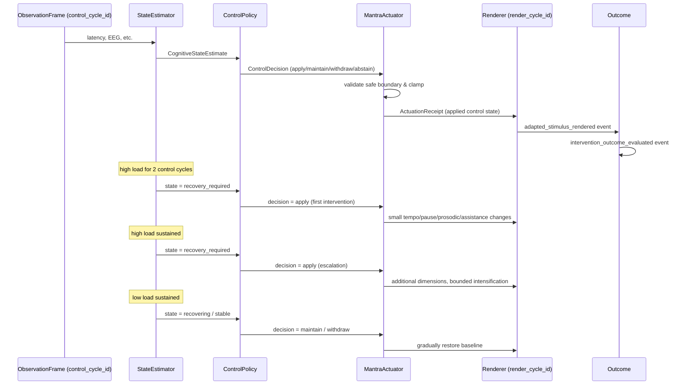

# CLM-01 — Closed-Loop Mantra Control Vertical Slice

## Summary

CLM-01 implements the first executable, domain-neutral cognitive control loop for MindTune Lab. It proves the causal chain:

```
ObservationFrame
  -> CognitiveStateEstimate
  -> ControlDecision
  -> MantraActuator
  -> ActuationReceipt
  -> AdaptedStimulus
  -> InterventionOutcome
```

The implementation lives in `packages/clm/src/mindtune_clm/`. It depends on the existing MPE `Runtime`, `EventStore`, and `Event` envelope, but MPE never imports `mindtune_clm`. The existing Immediate Recall protocol is left unchanged.

## Causal Loop

1. **Observation**: a multi-modal `ObservationFrame` arrives for a `control_cycle_id`. It may contain behavioral, EEG, respiration, and voice evidence. Missing modalities are ignored; low-quality evidence is rejected and the reason is preserved.
2. **State estimation**: the `StateEstimator` fuses evidence into a 0..1 cognitive load sample and applies deterministic hysteresis to move between `stable`, `possible_drift`, `recovery_required`, and `recovering`.
3. **Decision**: the `ControlPolicy` maps the estimate to a `ControlDecision` (`apply`, `maintain`, `withdraw`, `abstain`, `stop`). Every control cycle produces a decision.
4. **Actuation**: the `MantraActuator` validates the proposed `MantraControlState` against a safety envelope, applies it only at the declared safe boundary, and returns an `ActuationReceipt`.
5. **Rendering**: an `adapted_stimulus_rendered` event is emitted with the exact control parameters that a future audio renderer would receive. No audio is generated in CLM-01.
6. **Outcome**: an `intervention_outcome_evaluated` event records the observed control state, the rendered stimulus, and the decision that produced the intervention.

## Type Contracts

| Type | Location | Invariants |
|---|---|---|
| `ObservationFrame` | `mindtune_clm/observations.py` | Immutable; `observation_frame_id`, `control_cycle_id`, `session_id`, `sequence_number`, `observation_timestamp`; all sensor fields optional. |
| `CognitiveStateEstimate` | `mindtune_clm/state.py` | Immutable; references `source_observation_frame_id` and `source_control_cycle_id`; carries `evidence_used`, `evidence_rejected`, `reason_codes`. |
| `MantraControlState` | `mindtune_clm/state.py` | Immutable; baseline has `assistance_level = 0.0` (no added assistance); explicit safety bounds; `clamped()` returns a bounded copy. |
| `ControlDecision` | `mindtune_clm/decision.py` | Immutable; references `estimate_id`, `source_observation_frame_id`, `source_control_cycle_id`; contains `previous_control_state`, `proposed_control_state`, `decision_kind`, and `safe_application_boundary`. |
| `ActuationReceipt` | `mindtune_clm/actuator.py` | Immutable; records `decision_id`, `applied_control_state_id`, requested vs applied state, success, and optional rejection reason. |

## Execution Model: Control Cycles vs Render Cycles

CLM-01 distinguishes two kinds of cycles:

- **Control cycle**: one observation frame, one estimate, one decision, one actuation. The fixture provides six control cycles (`cc-1` ... `cc-6`).
- **Render cycle**: one mantra presentation. The session emits one initial baseline render (`rc-1`) and one render after each control cycle (`rc-2` ... `rc-7`), for a total of seven rendered mantra cycles.

## Baseline Semantics

A stable baseline means **no added assistance**. `MantraControlState` expresses this with `assistance_level = 0.0`. All other support-like parameters are at their neutral values:

```
tempo_ratio             = 1.0
pre_stimulus_pause_ms   = 0
post_stimulus_pause_ms  = 0
repetition_count        = 1
prosodic_emphasis       = 0.0
vocal_energy            = 0.0
breathing_cue           = False
assistance_level        = 0.0
```

## Progressive Assistance Policy

The `ControlPolicy` is progressive and bounded:

- **First intervention** (first `apply` in an episode): changes at most four dimensions (`tempo_ratio`, `post_stimulus_pause_ms`, `prosodic_emphasis`, `assistance_level`) by bounded deltas. It does not touch `repetition_count`, `breathing_cue`, or `vocal_energy`.
- **Escalation**: after a minimum number of consecutive `recovery_required` cycles (`min_cycles_before_escalation = 3`), `apply` may increase additional dimensions (`repetition_count`, `vocal_energy`, `breathing_cue`) and deepen the bounded dimensions.
- **Maintenance**: `recovering` and intermediate `recovery_required` cycles hold the current support.
- **Withdrawal**: stable cycles move all non-baseline parameters back toward baseline at `withdrawal_rate` of the intervention step, so recovery is slower than escalation.

### Safety limits per decision

| Dimension | Max delta (apply/escalation) | Withdrawal rate |
|---|---|---|
| `tempo_ratio` | 0.05 | 0.5 |
| `post_stimulus_pause_ms` | 300 ms | 0.5 |
| `prosodic_emphasis` | 0.1 | 0.5 |
| `assistance_level` | 0.2 | 0.5 |
| `vocal_energy` | 0.3 | 0.5 |
| `repetition_count` | 1 | 0.5 |
| `max_total_assistance` | 1.0 | — |
| `max_dimensions_first_intervention` | 4 | — |
| `min_cycles_before_escalation` | 3 | — |

The actuator also clamps every applied state to `MantraControlState.BOUNDS`.

## Hysteresis

- `high_threshold` = 0.6, `low_threshold` = 0.3.
- One high sample: `stable -> possible_drift`.
- Two consecutive high samples: `possible_drift -> recovery_required` (or directly from `stable` after two samples).
- One low sample from `recovery_required`: `recovery_required -> recovering` (initial recovery; assistance maintained).
- A second low sample while `recovering`: completes recovery and returns to `stable`.
- A dead band between thresholds resets the consecutive counters, preventing oscillation.

This means a single noisy sample, physiological or behavioral, cannot trigger an immediate high-impact intervention.

## Sensor Independence

- Behavioral evidence is always used when present.
- EEG is used only when `eeg_quality` does not contain `artifact`, `poor_signal`, or `poor`.
- Missing EEG is treated as "EEG absent" and the loop continues.
- Respiration and voice fields are placeholders in CLM-01; they are accepted but not used for control.
- A high-quality physiological deterioration can contribute to the estimate even before an overt behavioral error.

## Actuator Safety Envelope

`MantraControlState.BOUNDS` enforce the following per-field ranges:

```
tempo_ratio             [0.5, 1.0]
pre_stimulus_pause_ms   [0, 5000]
post_stimulus_pause_ms  [0, 3000]
repetition_count        [1, 5]
prosodic_emphasis       [0.0, 1.0]
vocal_energy            [0.0, 1.0]
breathing_cue           {False, True}
assistance_level        [0.0, 1.0]
```

The actuator clamps any requested state into these ranges. A decision with an out-of-bounds proposed state still succeeds because the applied state is clamped; a decision with the wrong safe boundary fails.

## Event Provenance

All CLM-01 events use the existing MPE `Event` envelope and are appended to the same `EventStore`. Event types added for this slice:

- `observation_frame_created`
- `cognitive_state_estimated`
- `control_decision_made`
- `actuation_requested`
- `actuation_applied`
- `adapted_stimulus_rendered`
- `intervention_outcome_evaluated`

Each event's `provenance` list points to the immediately preceding causal event, and payloads carry direct references:

| Event | Direct references |
|---|---|
| `cognitive_state_estimated` | `source_observation_frame_id`, `source_control_cycle_id`, `evidence_used`, `evidence_rejected` |
| `control_decision_made` | `estimate_id`, `source_observation_frame_id`, `source_control_cycle_id` |
| `actuation_requested` | `decision_id`, `requested_control_state_id` |
| `actuation_applied` | `decision_id`, `applied_control_state_id` |
| `adapted_stimulus_rendered` | `actuation_receipt_id`, `applied_control_state_id`, `render_cycle_id` |
| `intervention_outcome_evaluated` | `rendered_stimulus_id`, `render_cycle_id`, `actuation_receipt_id`, `applied_control_state_id`, `decision_id`, `estimate_id` |

`RuntimeState` applies these events through no-op handlers, so replay remains deterministic.

## Sequence Diagram



## Acceptance Criteria

The principal acceptance test (`test_acceptance_causal_chain_decision_to_actuation_to_renderer`) proves:

- a `control_decision_made` event at the sustained-deterioration cycle is `apply`;
- an `actuation_requested` event causally follows the decision;
- an `actuation_applied` event causally follows the request and is successful;
- the next `adapted_stimulus_rendered` event causally follows the actuation and uses the applied control parameters.

Additional required properties are covered by the 19 deterministic tests in `packages/clm/tests/test_clm01.py`, including:

- first intervention changes only bounded dimensions;
- one intervention cannot jump to maximum assistance;
- persistent deterioration produces gradual escalation;
- initial recovery maintains support;
- sustained recovery withdraws support more slowly than escalation;
- the state returns exactly to baseline after enough stable cycles;
- each rendered stimulus uses one and only one applied control-state version;
- no renderer independently recomputes actuator parameters;
- the causal graph is reconstructable from event payloads.

## Known Limitations

- The actuator is in-memory and does not generate audio; it emits the exact control parameters for a future renderer.
- Recovery and intervention step sizes are design parameters without empirical calibration in this slice.
- Only one fixture (`make_clm01_fixture`) is provided; richer multi-session validation is out of scope.
- The compatibility adapter to call this layer from the existing Immediate Recall protocol is deferred to a later phase.
