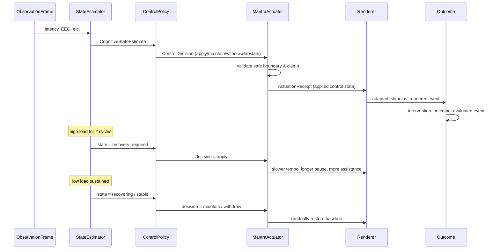

# CLM-01 — Closed-Loop Mantra Control Vertical Slice

## Summary

CLM-01 implements the first executable, domain-neutral cognitive control loop for MindTune Lab. It proves the causal chain:

```
ObservationFrame
  -> CognitiveStateEstimate
  -> ControlDecision
  -> MantraActuator
  -> ActuationReceipt
  -> AdaptedStimulus
  -> InterventionOutcome
```

The implementation is additive: it lives in `packages/mpe/src/mpe/control/` and uses the existing MPE `Runtime`, `EventStore`, and `Event` envelope. The existing Immediate Recall protocol is left unchanged.

## Causal Loop

1. **Observation**: a multi-modal `ObservationFrame` arrives. It may contain behavioral, EEG, respiration, and voice evidence. Missing modalities are ignored; low-quality evidence is rejected and the reason is preserved.
2. **State estimation**: the `StateEstimator` fuses evidence into a 0..1 cognitive load sample and applies deterministic hysteresis to move between `stable`, `possible_drift`, `recovery_required`, and `recovering`.
3. **Decision**: the `ControlPolicy` maps the estimate to a `ControlDecision` (`apply`, `maintain`, `withdraw`, `abstain`, `stop`). Every cycle produces a decision.
4. **Actuation**: the `MantraActuator` validates the proposed `MantraControlState` against a safety envelope, applies it only at the declared safe boundary, and returns an `ActuationReceipt`.
5. **Rendering**: an `adapted_stimulus_rendered` event is emitted with the exact control parameters that a future audio renderer would receive. No audio is generated in CLM-01.
6. **Outcome**: an `intervention_outcome_evaluated` event records the observed control state and trend.

## Type Contracts

| Type | Location | Invariants |
|---|---|---|
| `ObservationFrame` | `mpe/control/observations.py` | Immutable; at least `observation_frame_id`, `session_id`, `sequence_number`, `observation_timestamp`; all sensor fields optional. |
| `CognitiveStateEstimate` | `mpe/control/state.py` | Immutable; carries `cognitive_state`, load, confidence, `evidence_used`, `evidence_rejected`, and `reason_codes`. |
| `MantraControlState` | `mpe/control/state.py` | Immutable; explicit baseline and safety bounds; `clamped()` returns a bounded copy. |
| `ControlDecision` | `mpe/control/decision.py` | Immutable; contains `previous_control_state`, `proposed_control_state`, `decision_kind`, and `safe_application_boundary`. |
| `ActuationReceipt` | `mpe/control/actuator.py` | Immutable; records requested vs applied state, success, and optional rejection reason. |

## Control Frequencies and Safe Application Boundaries

- The loop executes once per observation frame (one control cycle per frame).
- All actuations require the safe boundary `between_mantra_cycles`.
- The actuator rejects any decision that does not declare this boundary.
- The rendered stimulus is produced immediately after the actuation is applied, so the next mantra cycle can use the new control parameters.

## Hysteresis

- `high_threshold` = 0.6, `low_threshold` = 0.3.
- One high sample: `stable -> possible_drift`.
- Two consecutive high samples: `possible_drift -> recovery_required` (or directly from `stable` after two samples).
- One low sample from `recovery_required`: `recovery_required -> recovering` (initial recovery; assistance maintained).
- A second low sample while `recovering`: completes recovery and returns to `stable`.
- A dead band between thresholds resets the consecutive counters, preventing oscillation.

This means a single noisy sample, physiological or behavioral, cannot trigger an immediate high-impact intervention.

## Sensor Independence

- Behavioral evidence is always used when present.
- EEG is used only when `eeg_quality` does not contain `artifact`, `poor_signal`, or `poor`.
- Missing EEG is treated as "EEG absent" and the loop continues.
- Respiration and voice fields are placeholders in CLM-01; they are accepted but not used for control.
- A high-quality physiological deterioration can contribute to the estimate even before an overt behavioral error.

## Actuator Safety Envelope

`MantraControlState.BOUNDS` enforce the following per-field ranges:

```
tempo_ratio             [0.5, 1.0]
pre_stimulus_pause_ms   [0, 5000]
post_stimulus_pause_ms  [0, 3000]
repetition_count        [1, 5]
prosodic_emphasis       [0.0, 1.0]
vocal_energy            [0.0, 1.0]
breathing_cue           {False, True}
assistance_level        [0, 5]
```

The actuator clamps any requested state into these ranges. A decision with an out-of-bounds proposed state still succeeds because the applied state is clamped; a decision with the wrong safe boundary fails.

## Event Provenance

All CLM-01 events use the existing MPE `Event` envelope and are appended to the same `EventStore`. Event types added for this slice:

- `observation_frame_created`
- `cognitive_state_estimated`
- `control_decision_made`
- `actuation_requested`
- `actuation_applied`
- `adapted_stimulus_rendered`
- `intervention_outcome_evaluated`

Each event's `provenance` list points to the immediately preceding causal event, forming a chain from observation to outcome. `RuntimeState` applies these events through no-op handlers, so replay remains deterministic.

## Sequence Diagram



## Acceptance Criteria

The principal acceptance test (`test_acceptance_causal_chain_decision_to_actuation_to_renderer`) proves:

- a `control_decision_made` event at the sustained-deterioration cycle is `apply`;
- an `actuation_requested` event causally follows the decision;
- an `actuation_applied` event causally follows the request and is successful;
- the next `adapted_stimulus_rendered` event causally follows the actuation and uses the applied control parameters.

All other required properties (observation->estimate, estimate->decision, noisy-EEG rejection, EEG absence handling, safety bounds, maintenance during initial recovery, gradual withdrawal, event provenance, determinism) are covered by the 13 deterministic tests in `packages/mpe/tests/test_clm01.py`.

## Known Limitations

- The actuator is in-memory and does not generate audio; it emits the exact control parameters for a future renderer.
- Recovery and intervention step sizes are design parameters without empirical calibration in this slice.
- Only one fixture (`make_clm01_fixture`) is provided; richer multi-session validation is out of scope.
- The compatibility adapter to call this layer from the existing Immediate Recall protocol is deferred to a later phase.
