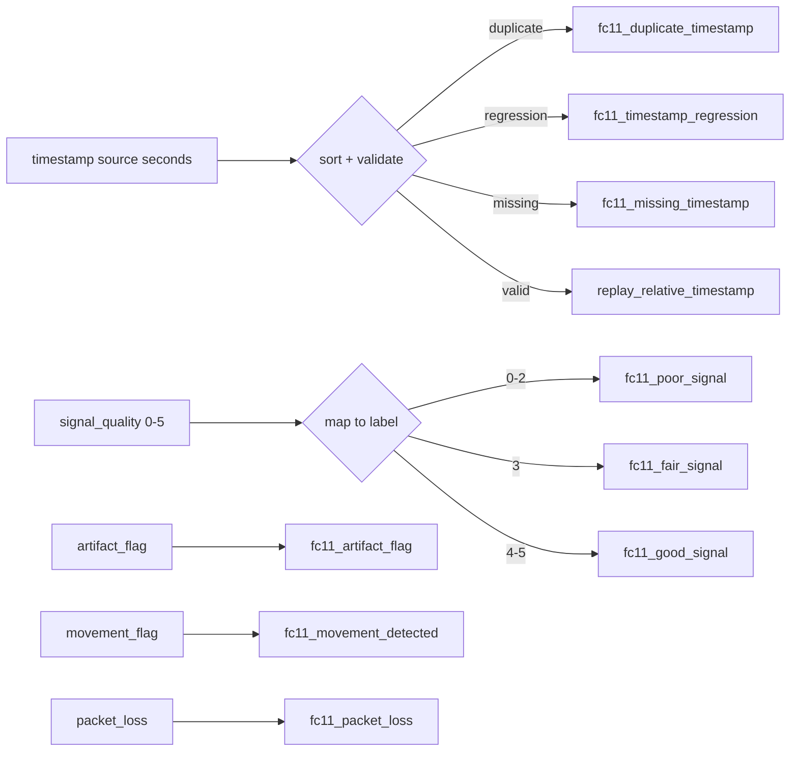
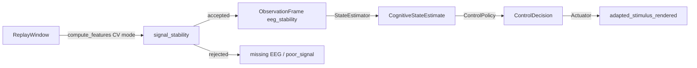

# CLM-02B — FC11 Recorded Data Adapter

## Scope

CLM-02B is a versioned adapter that converts the recorded output of the FocusCalm FC11 pipeline into the deterministic CLM-02 replay contracts. It is **recorded-data-only**: no live BLE, no audio generation, no network calls.

## Authoritative source format selected

`fc11_eeg_csv_v1` — a paired CSV + JSON sidecar export.

- `*.csv` rows: `timestamp,packet_index,eeg_scaled,attention_score_smoothed,meditation_score_smoothed,signal_quality,artifact_flag,movement_flag,packet_loss`
- `*.json` sidecar: sample rate, packet size, channel list, parser/parser versions, provenance.

This format was selected because:

1. `server.py` references `MAC_SESSIONS/session_*.csv` with a `.json` sidecar and `MINDTUNE_SESSIONS/*/samples.csv` or `packets.csv`.
2. The golden reference fixture `FOCUSCALM_CONTROLLED_CAPTURE_GOLDEN_v1.json` documents `sample_rate_hz=160.6`, `gain=128`, `scale_factor`, and per-window `attention`/`meditation` features derived from an FC11 CSV named `fc11_stream_*_eeg.csv`.
3. The CSV+JSON pair preserves raw sample ordering and keeps metadata separate from checksums, matching CLM-02 source-immutability requirements.

## Alternative formats inspected

| Format | Location | Status | Reason not authoritative |
|--------|----------|--------|--------------------------|
| `session_*.csv` + `.json` sidecar | `MAC_SESSIONS` (referenced by `server.py`) | supported-equivalent | Same schema family; the adapter's `fc11_eeg_csv_v1` is a normalized view of this layout. |
| `samples.csv` / `packets.csv` + `session.json` | `MINDTUNE_SESSIONS` (referenced by `server.py`) | not implemented | Structural variant; can be added as `fc11_eeg_csv_v2` without changing the generic replay runner. |
| `FOCUSCALM_NATIVE_FEATURES_v1.json` | recovery fixtures | used for validation | Already-windowed feature vectors, not a raw recorded export. |
| `FOCUSCALM_CONTROLLED_CAPTURE_GOLDEN_v1.json` | recovery fixtures | used for validation | Golden windowed output, not the raw stream. |

## Reconciliation table

| Field or concept | Current capture-code evidence | Prior audit evidence | Status | CLM-02B treatment |
|------------------|------------------------------|----------------------|--------|-------------------|
| FC11 headband target | `server.py` paths and UI strings | FocusCalm FC11 | verified | device type `eeg` |
| `sample_rate_hz` | golden JSON `160.6` Hz | native BLE 20 samples/packet | partially_verified | parsed from sidecar, default 10 Hz in fixtures for determinism |
| `eeg_scaled` amplitude | golden JSON windowed scaled samples | unverified scale origin | locally_derived | preserved as `eeg_scaled`, not renamed to microvolts |
| `attention` / `meditation` | golden JSON `attention`/`meditation` dicts with `score_smoothed` | vendor-defined metrics | vendor_defined | normalized to [0,1] as contextual features, never labeled as validated cognitive state |
| `signal_quality` | inferred from quality codes | generic EEG quality | partially_verified | mapped 0-5 integer to `poor`/`fair`/`good` |
| `artifact_flag` | CSV schema | artifact events | partially_verified | parsed as boolean, emits `fc11_artifact_flag` |
| `movement_flag` | CSV schema | IMU-related data | partially_verified | parsed as boolean, emits `fc11_movement_detected` |
| `packet_loss` | CSV schema + `packet_index_gaps` sidecar | packet timing | partially_verified | parsed as boolean, emits `fc11_packet_loss` |
| native band values | not present in CSV fixture | native band paths | not_required_for_clm02b | not implemented; preserved as unverified if added later |
| cognitive-load claim | not supported | unverified BLE-to-native chain | unverified | explicitly not made; CLM-01 uses `eeg_stability` from CV of `eeg_scaled` |

## Source schema

```mermaid
flowchart LR
    A[FC11 CSV + JSON sidecar] -->|FC11CSVParser| B(SensorSample)
    B -->|FC11NormalizationPolicy| C(NormalizedSensorSample)
    C -->|FC11QualityPolicy| D(QualityAssessment)
    D -->|make_windows| E(ReplayWindow)
    E -->|to_observation_frame| F(ObservationFrame)
    F -->|ControlLoop| G(CLM-01 decisions)
```

## Timestamp and quality processing

## FC11 window → ObservationFrame → Decision Engine

## Schema mapping table

| FC11 field | Meaning | Unit | Canonical field | Normalization | Quality use |
|------------|---------|------|-----------------|---------------|-------------|
| `timestamp` | source elapsed time | seconds | `source_timestamp` / `replay_relative_timestamp` | subtract `start_timestamp` | duplicate/regression/missing checks |
| `packet_index` | packet sequence | integer | `channel_values['packet_index']` | none | gap detection |
| `eeg_scaled` | scaled EEG amplitude | dimensionless | `channel_values['eeg_scaled']` | none (already scaled) | primary channel for `eeg_stability` via coefficient-of-variation |
| `attention_score_smoothed` | vendor attention score | 0-100 percentage | `channel_values['attention_score_smoothed']` | `/ 100` to [0,1] | contextual feature only, not used for control |
| `meditation_score_smoothed` | vendor meditation score | 0-100 percentage | `channel_values['meditation_score_smoothed']` | `/ 100` to [0,1] | contextual feature only, not used for control |
| `signal_quality` | integer quality code | 0-5 integer | `raw_quality` | 0-2→`poor`, 3→`fair`, 4-5→`good` | `fc11_poor_signal` if 0-2 |
| `artifact_flag` | artifact detected | 0/1 | `channel_values['artifact_flag']` | `bool` | `fc11_artifact_flag` |
| `movement_flag` | movement/IMU flag | 0/1 | `channel_values['movement_flag']` | `bool` | `fc11_movement_detected` |
| `packet_loss` | sample/packet was lost | 0/1 | `channel_values['packet_loss']` | `bool` | `fc11_packet_loss` |

## Normalization rules

- `attention_score_smoothed` and `meditation_score_smoothed` are divided by 100 to map percentages to the unit interval.
- `artifact_flag`, `movement_flag`, `packet_loss` are normalized to `0.0` or `1.0`.
- `eeg_scaled` is preserved as-is because the sidecar `scale_factor` already reflects the native-to-scaled conversion.
- Unknown optional columns are recorded in `source.metadata` but are not silently reinterpreted.

## Quality rules

- `fc11_missing_timestamp` — empty or unparseable timestamp.
- `fc11_duplicate_timestamp` — identical timestamp already seen.
- `fc11_timestamp_regression` — timestamp less than previous.
- `fc11_missing_required_channel` — `eeg_scaled` missing.
- `fc11_malformed_record` — wrong column count or unparseable cell.
- `fc11_artifact_flag` — `artifact_flag == 1`.
- `fc11_movement_detected` — `movement_flag == 1`.
- `fc11_packet_loss` — `packet_loss == 1`.
- `fc11_poor_signal` — `signal_quality` 0-2.
- `fc11_flatline` — all channels unchanged across consecutive samples.
- `fc11_amplitude_out_of_range` — value outside policy bounds.
- `fc11_insufficient_window_coverage` — fewer than `min_accepted_sample_count` accepted samples in a window.

## Gap and packet-loss rules

- No interpolation is performed.
- Missing samples create explicit gaps; windows with too few accepted samples are rejected.
- `packet_loss` flags are treated as sample-level rejection.
- `packet_index` is preserved for future gap analysis but does not alter replay timestamps.

## Sampling-rate assumptions

- Canonical FC11 rate from golden fixture is ~160.6 Hz.
- Synthetic fixtures use 10 Hz for compact deterministic test replay.
- The adapter uses `sample_rate_hz` from the sidecar; `sample_interval = 1/rate`.

## Digest determinism

The canonical digest includes:

- `content_checksum` of the CSV
- `metadata_checksum` of the JSON sidecar
- parser ID and version
- normalization policy ID and version
- quality policy ID and version
- window and feature policy versions
- CLM policy version
- normalized samples, assessments, windows, observation frames, and CLM trajectory

Changing the parser, timestamp policy, normalization policy, quality policy, or feature policy version changes the digest.

## Privacy protections

- No real personal recordings are committed.
- Fixtures contain only synthetic, schema-derived data.
- No names, emails, serial numbers, MAC addresses, or absolute paths are stored in canonical payloads.
- Source fixture handles are relative to `packages/clm/tests/fixtures/fc11/`.

## Unsupported fields

- Native EEG band power values are not implemented pending a verified recorded export.
- IMU accelerometer/gyroscope streams are not implemented.
- Raw BLE packet-level captures are not implemented.

## Migration path to CLM-04 live sensor gateway

The FC11 adapter reuses the generic CLM-02 `ReplayRunner` and `ObservationFrame` contracts. A future CLM-04 live gateway can stream `SensorSample` objects into the same `normalize_samples` → `assess_sample` → `make_windows` → `to_observation_frame` pipeline by supplying a real-time `SensorSourceParser` and replacing the file-based `load_fc11_source_from_text` with a ring-buffer source.

## Files

- `packages/clm/src/mindtune_clm/replay/fc11/__init__.py`
- `packages/clm/src/mindtune_clm/replay/fc11/schema.py`
- `packages/clm/src/mindtune_clm/replay/fc11/source.py`
- `packages/clm/src/mindtune_clm/replay/fc11/metadata.py`
- `packages/clm/src/mindtune_clm/replay/fc11/parser.py`
- `packages/clm/src/mindtune_clm/replay/fc11/normalization.py`
- `packages/clm/src/mindtune_clm/replay/fc11/quality.py`
- `packages/clm/src/mindtune_clm/replay/fc11/adapter.py`
- `packages/clm/src/mindtune_clm/replay/fc11/events.py`
- `packages/clm/tests/fixtures/fc11/*.{csv,json}`
- `packages/clm/tests/test_clm02b.py`
