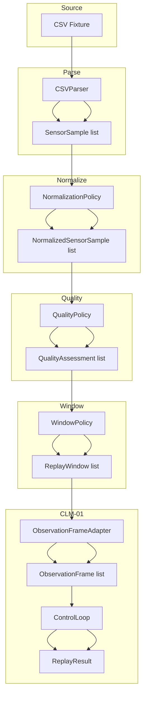

# CLM-02: Deterministic Sensor Replay

## Purpose

CLM-02 adds a deterministic replay layer that takes recorded sensor data, converts it into `ObservationFrame`s, and feeds those frames through the existing CLM-01 closed-loop control kernel. The goal is to guarantee that the same recording, parsed with the same policies, always produces the same control-loop outcome.

## Scope

- Replay-only: no live devices, no real audio generation, no network calls.
- Extends `packages/clm/src/mindtune_clm/replay/`.
- Dependency direction remains `mindtune_clm -> mpe`; `mpe` never imports `mindtune_clm`.
- Existing MPE and CLM-01 behavior and tests are preserved.

## Causal Chain


Each arrow is a deterministic, versioned transformation. Every intermediate object carries provenance identifiers so the causal graph can be reconstructed from the event store.

## Source Format

CLM-02 supports a simple CSV source format (`csv_v1`). Files are committed under `packages/clm/tests/fixtures/replay/` and are synthetic/anonymized.

```csv
timestamp,eeg_stability,quality
0.0,0.95,good
0.1,0.95,good
```

- `timestamp` in seconds, monotonically non-decreasing.
- `eeg_stability` dimensionless [0, 1].
- `quality` optional per-sample flag: `good`, `artifact`, `poor`.

The source recording is loaded as text, checksummed, and never rewritten during replay.

## Required Models

| Model | Responsibility |
| --- | --- |
| `RecordedSensorSource` | Immutable identity, checksum, and metadata of a recording. |
| `ReplayManifest` | All policy versions and deterministic seed required to reproduce a replay. |
| `NormalizedSensorSample` | A sample after unit conversion, timestamp validation, and missing-value handling. |
| `QualityAssessment` | Accept/reject decision with reason codes for a sample or window. |
| `ReplayWindow` | A fixed-duration, half-open window of normalized samples with deterministic features. |
| `ReplayClock` | Deterministic clock driven by source timestamps; no wall-clock access. |
| `ReplayResult` | Full outcome including manifest, samples, windows, frames, CLM cycles, and digest. |
| `ReplayDigest` | Canonical SHA-256 digest of a deterministic replay representation. |
| `PolicyComparisonResult` | Offline comparison of multiple CLM policies over the same replay windows. |

## Pipeline



## Determinism Guarantees

1. **Source immutability.** The fixture text is checksummed before replay; the on-disk file is not modified.
2. **Stable IDs.** Sample, window, and observation-frame IDs are derived from `source_id` + index + `replay_id`.
3. **No wall clock.** `ReplayClock` advances only by configured `sample_interval` and replay event count.
4. **Canonical digest.** `ReplayDigest` is computed from a stable JSON serialization that excludes UUIDs, absolute paths, and wall-clock timestamps.
5. **Duplicate/regression rules.** Duplicate timestamps keep the first occurrence; regressions are rejected and logged.

## Event Types

CLM-02 registers the following event types with MPE:

- `sensor_source_registered`
- `replay_manifest_created`
- `sensor_sample_parsed`
- `sensor_sample_normalized`
- `sensor_quality_assessed`
- `replay_window_created`
- `replay_window_rejected`
- `observation_frame_generated_from_replay`
- `sensor_replay_started`
- `sensor_replay_completed`
- `sensor_replay_failed`
- `replay_digest_computed`

Each event is emitted through the shared `mpe.runtime.Runtime` and therefore participates in the same session-provenance graph as CLM-01 events.

## Validation

```bash
.venv/bin/ruff check packages/clm/src/mindtune_clm/replay packages/clm/tests/test_clm02.py packages/mpe/src/mpe/events.py packages/mpe/src/mpe/aggregates.py
.venv/bin/mypy --exclude 'hebrew/' packages/clm/src/mindtune_clm/replay
PYTHONPATH="/Users/idonokurasani/Documents/Chatgpt/Biohacking/mindtune_console/packages/clm/src:/Users/idonokurasani/Documents/Chatgpt/Biohacking/mindtune_console/packages/mpe/src" .venv/bin/python -m pytest packages/clm/tests/test_clm02.py -v
PYTHONPATH="/Users/idonokurasani/Documents/Chatgpt/Biohacking/mindtune_console/packages/clm/src:/Users/idonokurasani/Documents/Chatgpt/Biohacking/mindtune_console/packages/mpe/src" .venv/bin/python -m pytest packages/clm/tests/test_clm01.py -v
PYTHONPATH="/Users/idonokurasani/Documents/Chatgpt/Biohacking/mindtune_console/packages/clm/src:/Users/idonokurasani/Documents/Chatgpt/Biohacking/mindtune_console/packages/mpe/src" .venv/bin/python -m pytest packages/mpe/tests -q
```
