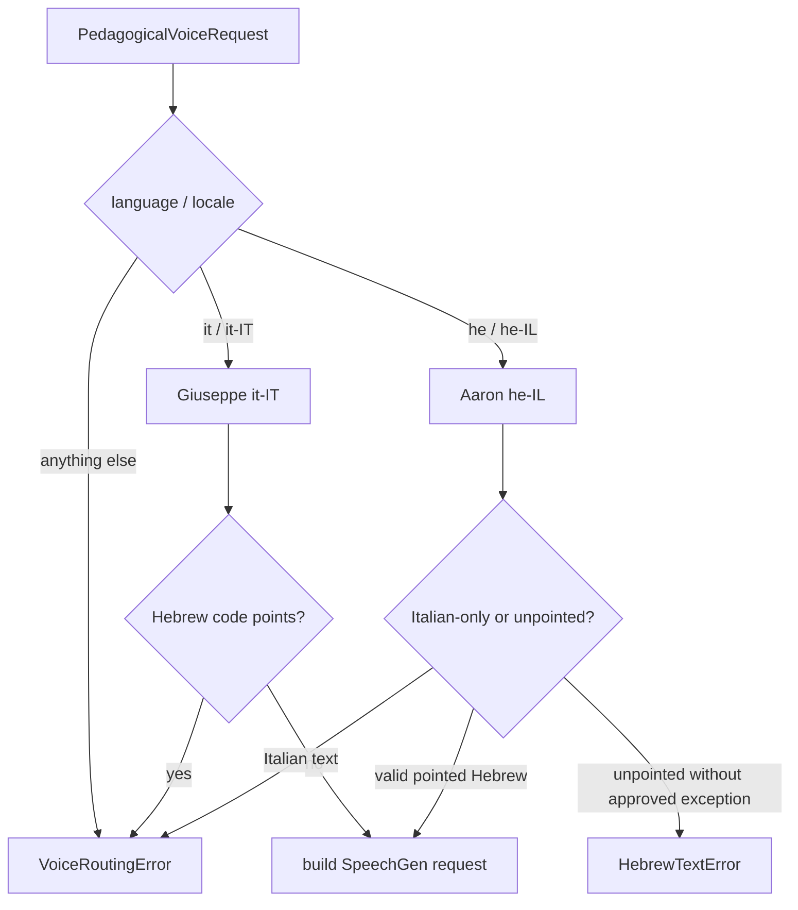
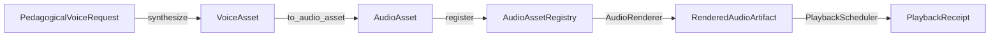
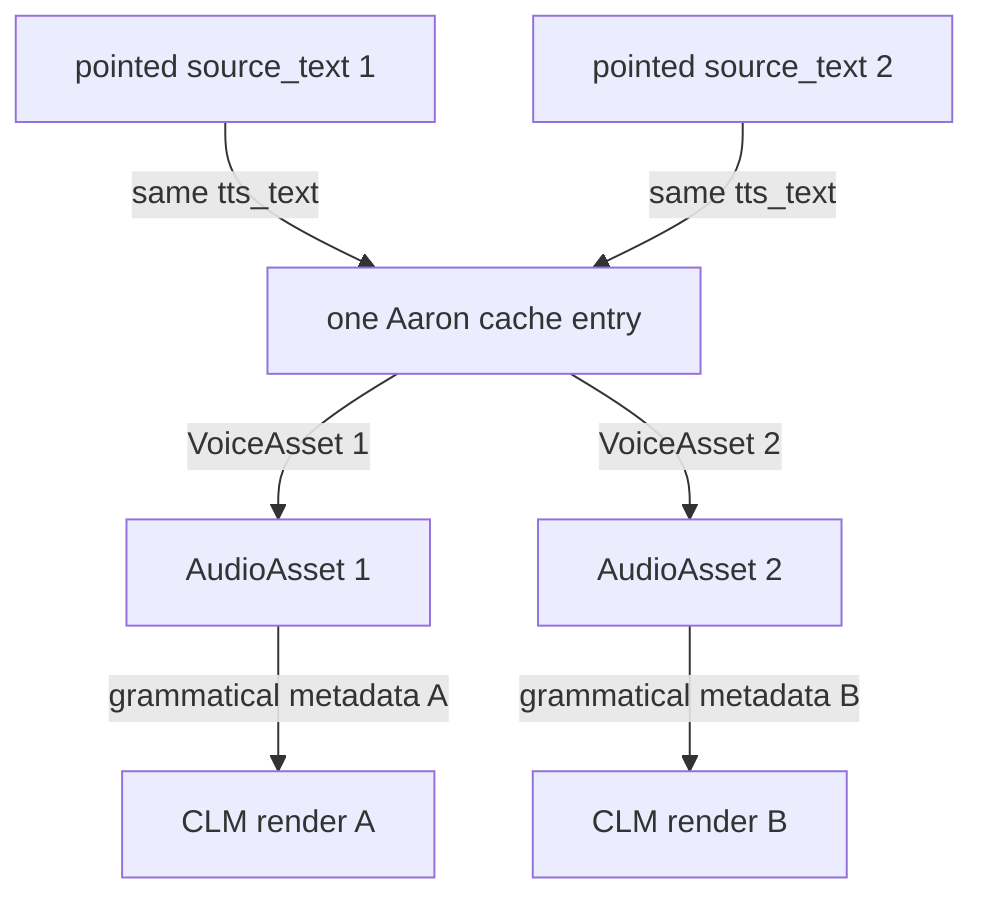
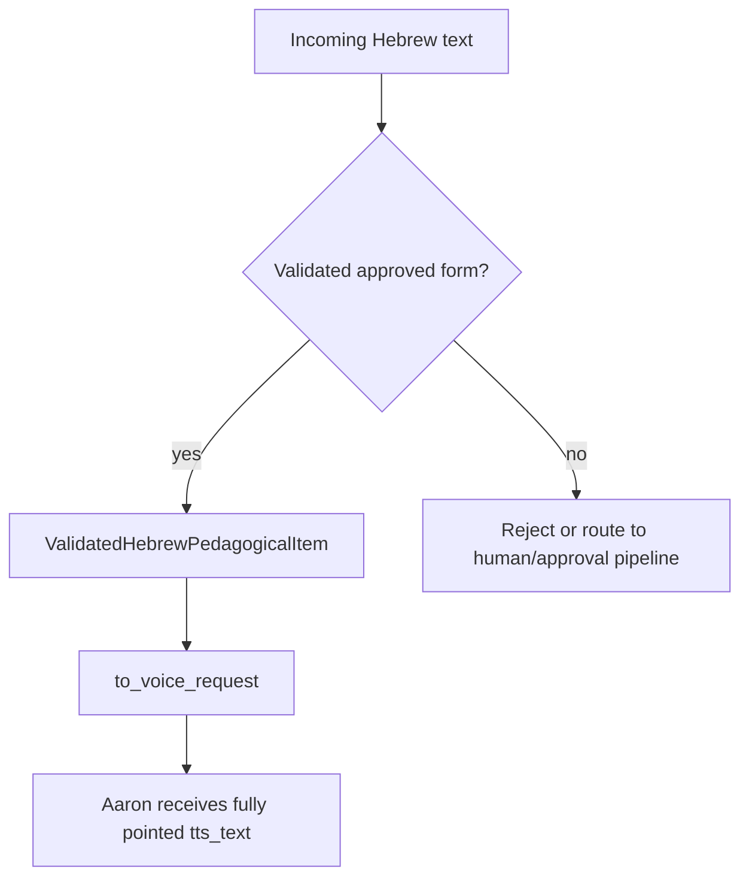
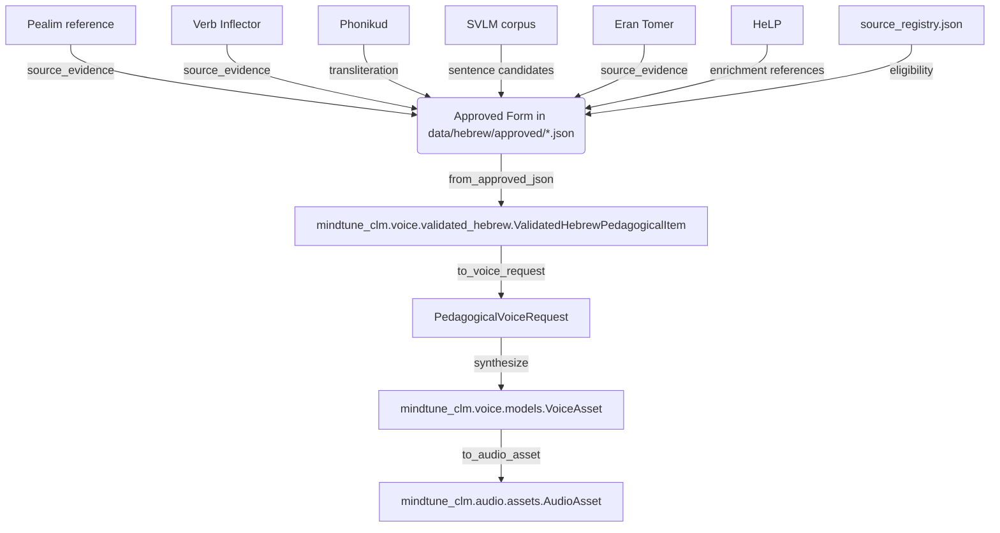

# CLM-03B — SpeechGen Giuseppe/Aaron Bilingual Voice Asset Pipeline

## Scope

CLM-03B adds a deterministic, content-addressed SpeechGen voice asset pipeline on top of the existing CLM-03 real audio actuator. It produces `VoiceAsset` objects that convert into canonical CLM-03 `AudioAsset` instances, so no renderer, scheduler, transform, or playback code is duplicated.

The pipeline proves this causal chain:

```
PedagogicalVoiceRequest
  → language router
  → SpeechGen request
  → provider receipt
  → voice-aware cache
  → canonical WAV AudioAsset
  → UtterancePlan
  → RenderedAudioArtifact
  → PlaybackReceipt
```

## Exclusions

- No live FC11 BLE acquisition changes.
- No FC11 replay semantics changes.
- No `server.py`, frontend, Raspberry Pi bridge, Oura, or EEG engine changes.
- No local TTS, cloud TTS other than SpeechGen, Hannah/Hila, or non-accepted voices.
- No Hebrew curriculum or frontend changes.

## Accepted provider and voices

Evidence files used for exact provider identifiers:

- `data/audio_profiles/production.json`
- `data/audio_profiles/hannah.json`
- `mantra/phase1/tts.py`
- `scripts/build_lichtov_giuseppe_aaron_conjugation.py`
- `output/mantra_phase1_lichtov_giuseppe_aaron/aaron_metadata.json`
- `output/mantra_phase1_lichtov_giuseppe_aaron/manifest.json`

| Provider | Locale | Voice ID | Use |
|---|---|---|---|
| `speechgen` | `it-IT` | `Giuseppe` | Italian labels, instructions, meanings |
| `speechgen` | `he-IL` | `Aaron` | Hebrew sentences and isolated forms |

No other SpeechGen voice or provider is used in the production routing.

## Source-text / TTS-text contract

For every Hebrew request the system stores and preserves two independent strings:

- `source_text`: canonical learner-facing Hebrew, fully vocalized with niqqud, dagesh, shin/sin dots, sheva, hataf vowels, maqaf, geresh, gershayim, and combining marks; Unicode NFC normalized but never stripped.
- `tts_text`: the exact Hebrew string submitted to SpeechGen Aaron. In the normal production case this is the same fully pointed string as `source_text`.

Unpointed Aaron input is only allowed when:

1. the exact unpointed form is in a versioned pronunciation override;
2. `unpointed_exception_approved=True` is set on the request;
3. the manifest records the override was intentional; and
4. the asset remains `human_review_status=pending` until human listening approval.

Italian `source_text` and `tts_text` may normally be identical. Accents, apostrophes, punctuation, abbreviations, and numbers are preserved.

## Reconciliation of existing accepted packages

The previously generated `output/mantra_phase1_lichtov_giuseppe_aaron/` package was inspected for reuse eligibility.

```
Total Aaron entries in manifest: 68
  pointed:    0
  unpointed: 62
  unknown:    6
```

The package `manifest.json` `text` fields are unpointed for all usable Hebrew entries. Example: `אני רוצה לכתוב מכתב` has no combining niqqud marks. Because CLM-03B production requires Aaron to receive the fully pointed `tts_text`, these historical assets are classified as `unpointed` and are **not reused automatically** for pointed production requests. They are not deleted or overwritten.

The Hannah profile `data/audio_profiles/hannah.json` records `hebrew_voice_id: Hannah`. No Hannah cache entry can satisfy an Aaron request because the cache key includes the exact `provider_voice_id`.

## Routing



Routing rules:

- Hebrew can never route to Giuseppe.
- Italian can never route to Aaron.
- No fallback to another voice or provider.
- No Hannah/Hila reference in new manifests or cache metadata.

## SpeechGen client

`SpeechGenClient` is a thin, injectable client:

- Credentials from `SPEECHGEN_API_KEY` and `SPEECHGEN_EMAIL` environment variables.
- Optional `SPEECHGEN_API_URL` override.
- Default endpoint: `https://speechgen.io/index.php?r=api/text`.
- HTTP transport is injectable for tests (`FakeTransport` in `test_clm03b.py`).
- Finite 120 s timeout and 3-attempt retry for synthesis.
- 60 s timeout for audio download.
- Credentials are redacted from events, logs, and error messages via `_safe_payload`.
- `emotion=good`, `sample_rate=22050`, `channels=1`, `format=wav`.

The client:

1. computes the voice route;
2. normalizes and validates the `tts_text`;
3. checks the `VoiceCache` by cache key;
4. on miss, POSTs the form request, downloads the `file` URL, validates WAV, canonicalizes to 16 kHz/16-bit/mono;
5. stores a `VoiceAsset` in the cache;
6. emits typed CLM-03B events.

## Cache identity

Cache key is a SHA-256 over a deterministic JSON payload containing:

- `provider`: `speechgen`
- `voice`: exact provider ID (`Aaron` or `Giuseppe`)
- `locale`: `he-IL` or `it-IT`
- `text`: exact `tts_text` including every niqqud mark
- `rate`, `pitch`, `format`, `emotion`, `sample_rate`, `channels`
- `normalization_policy_version`
- `synthesis_parameter_version`

It does **not** contain:

- API key
- wall-clock time
- machine name or username
- absolute paths

Therefore:

- Adding/removing one niqqud mark changes the cache key.
- Dagesh differences produce different keys.
- Shin/sin dot differences produce different keys.
- Pointed and unpointed forms cannot share a cache entry.
- A historical unpointed Aaron asset cannot satisfy a pointed request.
- A Hila/Hannah cache entry cannot satisfy an Aaron request.

## Canonical audio conversion

`VoiceAsset.canonical_pcm` is produced by `canonicalize_pcm`:

- Input: SpeechGen WAV, any sample rate up to 48 kHz, 1 or 2 channels, 8 or 16 bit.
- Output: 16,000 Hz, 16-bit signed PCM, mono, deterministic nearest-neighbor resample.
- No dither, no random processing, no wall-clock metadata.
- `VoiceAsset.to_audio_asset()` wraps the PCM in a CLM-03 `AudioAsset` with `content_checksum=SHA-256(canonical_pcm)`.

## Models

- `PedagogicalVoiceRequest`: request ID, language, locale, voice display name, provider voice ID, `source_text`, `tts_text`, checksums, metadata, review flags, provenance IDs.
- `SpeechGenRequest`: normalized provider request carrying exact synthesis text, parameters, request checksum, cache key, timeout/retry policy.
- `ProviderReceipt`: redacted, credential-free receipt with provider audio and canonical audio checksums.
- `VoiceAsset`: full canonicalized asset including `canonical_pcm`, human review status, and all provenance; can be converted to `AudioAsset`.

## CLM-03 integration



One Aaron or Giuseppe base asset supports multiple CLM-03 renders. Tempo, pause, repetition, vocal energy, and prosodic emphasis are applied by the existing CLM-03 renderer without additional SpeechGen calls.

## Shared audio with distinct metadata



Two different pointed pedagogical entries that share the same pointed `tts_text`, voice, locale, and synthesis parameters reuse the same cached audio but preserve their distinct `source_text`, `source_text_checksum`, and `grammatical_entry_ids`.

## Failure handling

- Missing credentials → `SpeechGenAuthError`.
- Provider HTTP error → `SpeechGenNetworkError` with safe payload.
- Provider JSON `error` field → `SpeechGenSynthesisError`.
- Empty or non-WAV download → `SpeechGenSynthesisError`.
- Corrupted cache entry → `VoiceCache.get` returns `None`, forcing a fresh synthesis.
- Invalid language route → `VoiceRoutingError`.
- Hebrew routed to Giuseppe or Italian to Aaron → `VoiceRoutingError`.
- Unpointed Aaron input without approved exception → `HebrewTextError`.

## Events

CLM-03B events registered with MPE:

- `pedagogical_voice_request_created`
- `voice_route_selected`
- `speechgen_request_created`
- `speechgen_cache_hit`
- `speechgen_cache_miss`
- `speechgen_synthesis_started`
- `speechgen_synthesis_completed`
- `speechgen_synthesis_failed`
- `speechgen_audio_validated`
- `voice_asset_canonicalized`
- `voice_asset_registered_with_clm03`
- `voice_cache_corruption_detected`
- `human_pronunciation_review_recorded`

No credential is emitted.

## Human review

`human_review_status` defaults to `pending`. Supported values: `pending`, `approved`, `rejected`, `override_required`. A successful SpeechGen synthesis is not pronunciation approval. Reviewer notes are preserved in provenance.

## Smoke test

`scripts/smoke_clm03b.py` is a manual, non-CI test requiring `SPEECHGEN_API_KEY` and `SPEECHGEN_EMAIL`. It writes to the gitignored `output/clm03b_smoke_cache/`, prints no credentials, and runs a second pass to verify cache hits.

## Files

- `packages/clm/src/mindtune_clm/voice/__init__.py`
- `packages/clm/src/mindtune_clm/voice/models.py`
- `packages/clm/src/mindtune_clm/voice/routing.py`
- `packages/clm/src/mindtune_clm/voice/speechgen.py`
- `packages/clm/src/mindtune_clm/voice/hebrew.py`
- `packages/clm/src/mindtune_clm/voice/italian.py`
- `packages/clm/src/mindtune_clm/voice/cache.py`
- `packages/clm/src/mindtune_clm/voice/canonicalize.py`
- `packages/clm/src/mindtune_clm/voice/receipts.py`
- `packages/clm/src/mindtune_clm/voice/digest.py`
- `packages/clm/src/mindtune_clm/voice/events.py`
- `packages/clm/src/mindtune_clm/voice/fixture_clm03b.py`
- `packages/clm/tests/test_clm03b.py`
- `scripts/smoke_clm03b.py`
- `docs/architecture/CLM_03B_SPEECHGEN_GIUSEPPE_AARON.md`
- `packages/mpe/src/mpe/events.py`
- `packages/mpe/src/mpe/aggregates.py`
- `pyproject.toml` (per-file C901 ignore for `speechgen.py`)

## Known limitations

- The SpeechGen client supports only `text` endpoint with `wav` downloads.
- Tempo is applied by nearest-neighbor resampling (CLM-03); pitch preservation is out of scope for CLM-03B.
- Historical `lichtov` Aaron assets are unpointed and are not reused automatically.

## Migration path to CLM-04

Replace `SpeechGenClient` with a live audio-device callback while keeping `VoiceAsset`, `AudioAsset`, `PlaybackCommand`, and `PlaybackReceipt` contracts unchanged.

## Relationship to the Existing Hebrew Language Engine

CLM-03B does not replace or move the existing engine in `hebrew/`; it consumes its already-approved, consensus-backed outputs.  The adapter layer `mindtune_clm.voice.validated_hebrew` is the only new integration surface.

### Reconciliation table

| Component | Repository path | Role | Inputs | Outputs | Authority level | CLM-03B integration point |
|---|---|---|---|---|---|---|
| Pealim reference | `data/hebrew/resources/pealim/pealim_forms.json` | scraped conjugation tables | lemma query | surface forms, transliteration | `reference_only` (per `source_registry.json`) | appears in `source_evidence` of approved forms; never called at runtime |
| Hebrew Verb Inflector | `data/hebrew/resources/verb_inflector/VerbInflector.jar`, `hebrew/adapters/java_inflector_adapter.py` | rule-based inflection generator | base form, pattern, table number | candidate forms | `production_approved` | appears in `source_evidence` of approved forms; never called at runtime |
| Phonikud | `hebrew/adapters/phonikud_adapter.py` | phonemization / stress prediction | vocalized or unvocalized Hebrew | IPA-style phonemes | `private_research_only` | transliteration stored in approved forms; never invoked by CLM-03B |
| SVLM corpus | `data/hebrew/resources/svlm/SVLM_Hebrew_Wikipedia_Corpus.txt` | example-sentence source | raw Wikipedia sentences | ranked candidates | `private_research_only` | not used for production audio until approved |
| Eran Tomer dataset | `data/hebrew/resources/eran_tomer/InflectedVerbsExtended.csv` | gold vocalized inflections | lemma | verified forms | `production_approved` | appears in `source_evidence` of approved forms; never called at runtime |
| HeLP | `packages/mpe/src/mpe/domains/hebrew/help/` (loader, models, repository, schemas, provenance) | psycholinguistic and normative evidence | verb/root/slot | RT/accuracy metrics and references | research support | `help_references` may be attached to a `ValidatedHebrewPedagogicalItem`; raw rows are never embedded or transmitted |
| Curriculum source | `data/hebrew/curriculum_v1_320.json` | canonical scope of the 320-verb course | selected verb list | curriculum records | production scope | `curriculum_version` and `source_curriculum_item_id` in the validated item |
| Approved forms | `data/hebrew/approved/*.json` (e.g. `לכתוב.json`, `לעשות.json`, `להיות.json`) | production truth for morphology | consensus candidate forms | `approval_status=approved` form dicts | `production_approved` | `ValidatedHebrewPedagogicalItem.from_approved_json` consumes these exclusively |
| Source registry | `data/hebrew/source_registry.json`, `hebrew/resources/source_registry.py` | license and eligibility authority | `source_id` | `SourceRecord` with `production_eligibility` | authority | drives `morphology_source_ids` and `pointing_provenance` filtering |

### No arbitrary free-text production Hebrew



CLM-03B now enforces the rule that only `curriculum_status=approved` forms with resolved conflicts, valid Unicode, and explicit pointing provenance become audio.  The `SpeechGenClient.synthesize` method accepts a `ValidatedHebrewPedagogicalItem` and routes it through `validated_hebrew.to_voice_request()`; any unvalidated object is rejected by typed `HebrewValidationError` subclasses before a provider call.

### Integration flow



### Cache identity with validation checksum

```mermaid
flowchart LR
    A[tts_text + voice + params] --> B{linguistic_identity_checksum?}
    B -->|provided| C[cache_key = sha256(payload + checksum)]
    B -->|not provided| D[cache_key = sha256(payload)]
    C --> E[prevents incompatible validated items from colliding]
```

`routing.cache_key` and `routing.request_checksum` now accept an optional `linguistic_identity_checksum` from the validated item.  Pointed/unpointed, dagesh, shin/sin dot, and niqqud pattern differences continue to produce distinct keys; when a validated item is supplied, the stable checksum is also mixed into the key so that two forms with the same surface string but different morphology provenance cannot accidentally share a cache entry.
