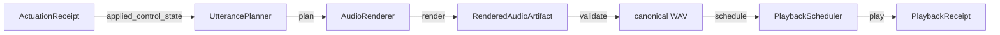
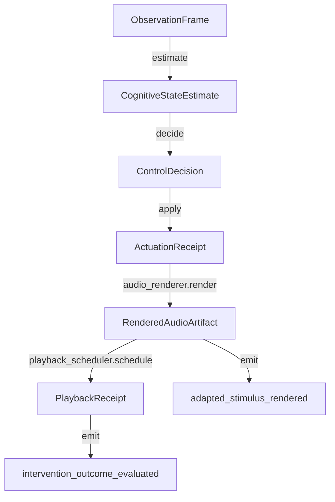
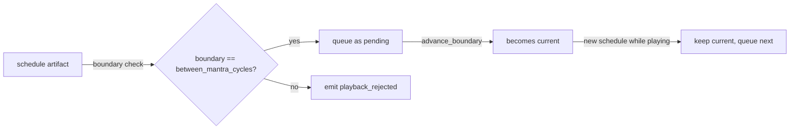
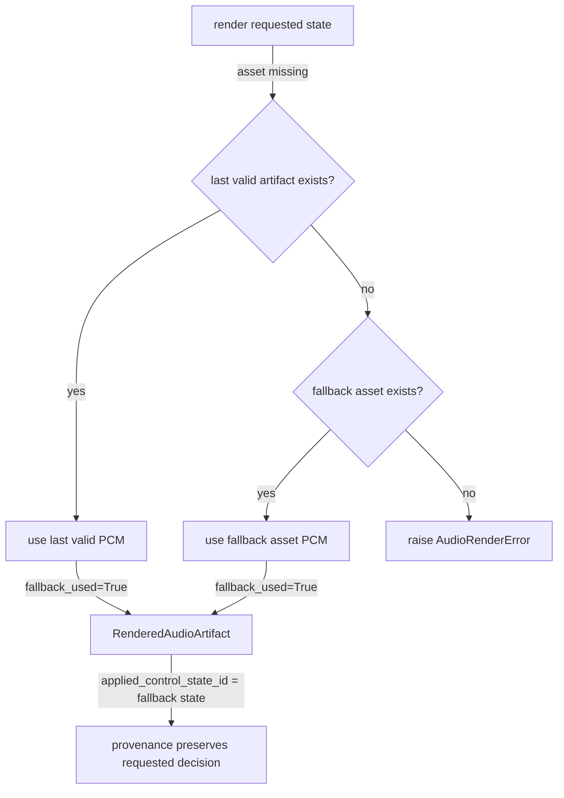

# CLM-03 — Real Mantra Audio Actuator

## Scope

CLM-03 replaces the simulated CLM-01 mantra renderer with a deterministic, offline, WAV-only audio actuator. It proves this causal chain:

```
ControlDecision
  → ActuationReceipt
  → MantraControlState
  → UtterancePlan
  → RenderedAudioArtifact
  → PlaybackCommand
  → PlaybackReceipt
```

A CLM decision made at control cycle N changes the actual PCM artifact scheduled for render cycle N+1.

## Exclusions

The following are explicitly **not** implemented in CLM-03:

- Hebrew-specific pronunciation logic or text-to-speech.
- Cloud TTS (SpeechGen, Azure Speech, AWS Polly).
- Live microphone capture.
- Live FocusCalm BLE acquisition.
- FC11 replay semantics changes.
- Adaptive policy learning.
- Frontend controls or FastAPI endpoints.
- Production audio-device management.
- Real copyrighted or personal voice recordings.

## Canonical WAV format

- **Container:** WAV RIFF
- **Code:c:** PCM, little-endian, signed
- **Sample width:** 16 bit
- **Sample rate:** 16,000 Hz
- **Channels:** 1 (mono)
- **Frame count:** deterministic integer based on input frames and transforms
- **No compression, no wall-clock metadata, no dither, no random noise**

All fixture assets are converted to this format on load.

## Source fixture assets

Only compact, synthetic, non-copyrighted WAV fixtures are committed:

- `speech_segment.wav` — 0.5 s, 440 Hz sine tone (role `speech_segment`).
- `breathing_cue.wav` — 0.3 s, 300 Hz sine with fade (role `breathing_cue`).

No personal recordings, copyrighted speech, or large generated files are committed.

## Causal chain 1: CLM receipt → utterance plan → rendered audio



## Causal chain 2: Control loop integration



## Safe-boundary scheduling



## Render failure and fallback



## Parameter-to-transform mapping

| Control state field | Audio transform | Formula / behavior |
|---|---|---|
| `tempo_ratio` | nearest-neighbor tempo | `out_frames = floor(in_frames / tempo_ratio)`; `out[i] = in[floor(i * tempo_ratio)]` |
| `pre_stimulus_pause_ms` | leading silence | `frames = floor(ms * sample_rate / 1000)` |
| `post_stimulus_pause_ms` | trailing silence | `frames = floor(ms * sample_rate / 1000)` |
| `repetition_count` | repeated speech segments | segment rendered `repetition_count` times in order |
| `prosodic_emphasis` | sinusoidal emphasis envelope | `multiplier = 1.0 + emphasis * sin(pi * i / (n-1))` |
| `vocal_energy` | uniform gain | `base_gain = 1.0 + 0.5 * vocal_energy` |
| `breathing_cue` | insert breathing cue asset | appended after speech and post-silence when `True` |
| `assistance_level` | provenance only | recorded in plan/artifact but does not add an extra transform |

Combined gain is clamped to `MAX_GAIN = 3.0`. Clipped samples are counted in `clipping_count`.

## Tempo limitation

CLM-03 uses nearest-neighbor resampling for tempo. This preserves deterministic byte-exact output but changes pitch for `tempo_ratio != 1.0`. Pitch-preserving time-stretch is a future CLM-03B improvement and is not required for the deterministic causal proof.

## Silence semantics

Silence is generated as zero-valued 16-bit PCM. The frame count is computed with floor rounding of milliseconds. There are no hidden fades.

## Repetition semantics

Each repetition is an independent segment. The `repetition_index` is recorded in every `UtteranceSegment`. Inter-repetition silence is not added unless explicitly configured via `pre_stimulus_pause_ms` or `post_stimulus_pause_ms`.

## Audio asset model (`AudioAsset`)

- `asset_id`
- `content_checksum` (SHA-256 of canonical WAV bytes)
- `role` (`speech_segment`, `breathing_cue`, `silence`, `tone_fixture`)
- `label`
- `sample_rate`, `sample_width`, `channels`
- `frame_count`, `duration`
- `source_type`
- `provenance`
- `semantic_tags`
- `canonical_pcm` (not exported in event payloads)

No absolute paths are stored in event payloads.

## Utterance plan model (`UtterancePlan`)

- `plan_id`
- `render_cycle_id`
- `ordered_segments` (`UtteranceSegment`)
- `canonical_audio_config`
- `source_control_state`
- `source_decision_id`
- `source_actuation_receipt_id`
- `safe_application_boundary`
- `expected_duration`
- `planner_id`, `planner_version`
- `plan_digest`

Each `UtteranceSegment` records `segment_id`, `asset_id`, `segment_role`, `sequence_index`, source start/end frames, `target_tempo_ratio`, `target_gain`, `target_prosodic_emphasis`, pre/post silence durations, `repetition_index`, `control_state_id`, `source_decision_id`, and `source_actuation_receipt_id`.

## Rendered audio artifact model (`RenderedAudioArtifact`)

- `artifact_id`
- `plan_id`
- `render_cycle_id`
- `audio_checksum`
- `canonical_bytes` (full WAV)
- `frame_count`, `duration`
- `sample_rate`, `channels`, `sample_width`
- `peak_amplitude`, `rms_amplitude`
- `clipping_count`
- `applied_control_state_id`
- `source_actuation_receipt_id`
- `renderer_id`, `renderer_version`
- `render_digest`
- `fallback_used`, `fallback_reason`

## Playback command and receipt models

`PlaybackCommand` carries `command_id`, `artifact_id`, `render_cycle_id`, `scheduled_semantic_timestamp`, `safe_boundary`, `expected_duration`, `control_state_id`, and `source_receipt_id`.

`PlaybackReceipt` carries `playback_receipt_id`, `command_id`, `artifact_id`, `accepted`, `semantic_start_timestamp`, `semantic_end_timestamp`, `expected_duration`, `observed_duration`, `latency`, `rejection_reason`, `fallback_used`, `control_state_id`, and `source_actuation_receipt_id`.

The simulated playback backend validates the real WAV and returns a receipt without using speakers.

## Deterministic audio digest

The `render_digest` is a SHA-256 over:

- canonical artifact metadata (excluding `canonical_bytes` absolute paths)
- SHA-256 of the rendered PCM bytes
- `applied_control_state_id`
- `source_actuation_receipt_id`
- `render_cycle_id`
- renderer version

The same control state, assets, and planner produce byte-identical `canonical_bytes` and the same digest. Changing the control state, asset content, planner version, or renderer version changes the digest.

## Audio events

MPE-registered CLM-03 events:

- `audio_asset_registered`
- `utterance_plan_created`
- `audio_render_started`
- `audio_segment_transformed`
- `audio_artifact_rendered`
- `audio_artifact_validated`
- `audio_render_failed`
- `playback_command_created`
- `playback_scheduled`
- `playback_started`
- `playback_completed`
- `playback_rejected`
- `audio_fallback_applied`
- `audio_digest_computed`

## CLM integration

`ControlLoop` accepts optional `audio_renderer` and `playback_scheduler` fields. When present, `_render_stimulus` calls `audio_renderer.render()` and `playback_scheduler.schedule()` and enriches the `adapted_stimulus_rendered` event with `audio_generated`, `audio_checksum`, `render_digest`, `playback_receipt_id`, and `playback_accepted`.

When `audio_renderer` is `None` the loop preserves the original CLM-01 simulated render payload.

## Latency measurement

The simulated playback backend records `latency` as a fixed configurable value (default 5 ms). This is a semantic latency for the receipt and is not derived from wall-clock time.

## Fixtures

- **A — baseline:** `tempo_ratio=1.0`, no pauses, one repetition, no cue, baseline gain. Output frame count equals source speech frames.
- **B — first bounded intervention:** `tempo_ratio=0.95`, `post_stimulus_pause_ms=300`, `prosodic_emphasis=0.1`, `assistance_level=0.2`. Output is longer than baseline and contains exact trailing silence.
- **C — escalated intervention:** `tempo_ratio=0.85`, `post_stimulus_pause_ms=500`, `repetition_count=2`, `breathing_cue=True`, `vocal_energy=0.3`. The cue and repetitions are physically present in the PCM.
- **D — withdrawal:** step 1 (`post=200`) and step 2 (`post=0`, all other parameters baseline). Step 2 is byte-equivalent to baseline.
- **E — failure and fallback:** render with a missing speech asset after a valid render; fallback uses the last valid artifact with explicit `fallback_used` and `fallback_reason`.

## Files

- `packages/clm/src/mindtune_clm/audio/__init__.py`
- `packages/clm/src/mindtune_clm/audio/assets.py`
- `packages/clm/src/mindtune_clm/audio/plan.py`
- `packages/clm/src/mindtune_clm/audio/renderer.py`
- `packages/clm/src/mindtune_clm/audio/transforms.py`
- `packages/clm/src/mindtune_clm/audio/scheduler.py` (note: playback scheduler is in `playback.py`)
- `packages/clm/src/mindtune_clm/audio/playback.py`
- `packages/clm/src/mindtune_clm/audio/receipts.py` (not used; receipts in `playback.py` and `renderer.py`)
- `packages/clm/src/mindtune_clm/audio/digest.py`
- `packages/clm/src/mindtune_clm/audio/events.py`
- `packages/clm/src/mindtune_clm/audio/fixture_clm03.py`
- `packages/clm/tests/fixtures/audio/*.wav`
- `packages/clm/tests/test_clm03.py`
- `packages/clm/src/mindtune_clm/loop.py`
- `packages/mpe/src/mpe/events.py`
- `packages/mpe/src/mpe/aggregates.py`

## Migration path

- **CLM-03B Hebrew voice assets:** Replace the synthetic `speech_segment.wav` with real Hebrew TTS assets loaded through `load_wav_asset`; the planner/renderer contracts remain unchanged.
- **CLM-04 live operation:** Replace the `SimulatedPlaybackBackend` with a real audio-device callback while keeping `PlaybackCommand`/`PlaybackReceipt` contracts.
