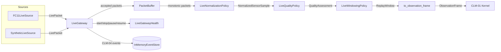
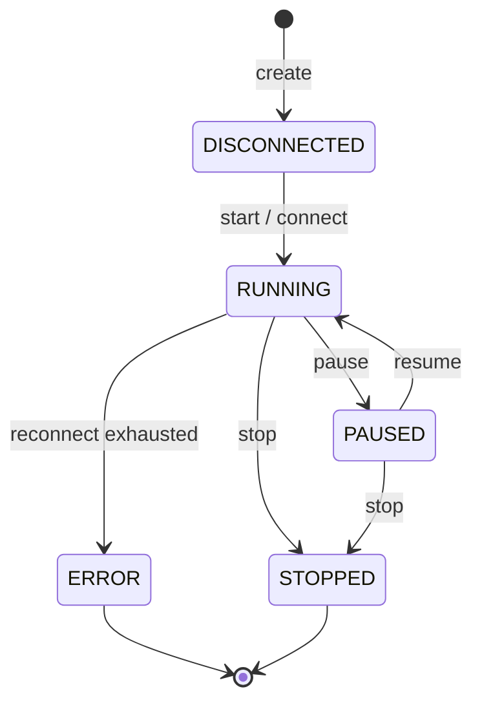

# CLM-04 — Live FC11 Sensor Gateway

## Purpose

CLM-04 is a provider-neutral live sensor gateway that receives FC11 EEG
packets, normalizes and quality-assesses them, builds deterministic half-open
windows, and emits `ObservationFrame`s that feed the same CLM-01 closed-loop
kernel used by CLM-02B replay.

The gateway deliberately **stops at `ObservationFrame`**. It does not invoke
SpeechGen, audio playback, or a separate live policy engine. The same
`FC11NormalizationPolicy`, `FC11QualityPolicy`, `WindowPolicy`, and
`to_observation_frame` contracts from CLM-02B are reused so that replay and
live execution converge on identical downstream states.

## Component Layout

## Data Flow

1. **Source abstraction** — `LiveSensorSource` connects, disconnects, and emits
   `LivePacket`s. `FC11LiveSource` wraps `FC11CSVParser`; `SyntheticLiveSource`
   generates deterministic packets for tests.
2. **Buffer** — `PacketBuffer` enforces bounded capacity, duplicate timestamp
   detection, and late/out-of-order packet rejection. It resets per connection
   epoch.
3. **Normalization & quality** — `LiveNormalizationPolicy` and
   `LiveQualityPolicy` subclass the CLM-02B FC11 policies unchanged.
4. **Windowing** — `LiveWindowingPolicy` calls `make_windows` to produce
   half-open `[start, end)` `ReplayWindow`s.
5. **Adapter** — `to_observation_frame` converts accepted windows into
   `ObservationFrame`s using `signal_stability` from the coefficient-of-variation
   feature policy.
6. **Events** — every lifecycle, packet, normalization, window, and frame event
   is appended to `InMemoryEventStore` using the MPE `Event` envelope.

## State Machine

## Event Types

All CLM-04 event strings are registered in `mpe.events.SUPPORTED_EVENT_TYPES`:

- `live_gateway_started`
- `live_gateway_paused`
- `live_gateway_resumed`
- `live_gateway_stopped`
- `live_gateway_completed`
- `live_gateway_health_changed`
- `live_sensor_source_connected`
- `live_sensor_source_disconnected`
- `live_sensor_source_reconnect_attempt`
- `live_sensor_source_reconnect_exhausted`
- `live_sensor_source_epoch_changed`
- `live_packet_received`
- `live_packet_late`
- `live_packet_duplicate`
- `live_buffer_overflow`
- `live_packet_normalized`
- `live_quality_assessed`
- `live_window_created`
- `live_window_rejected`
- `live_observation_frame_generated`

## Replay / Live Equivalence

The live pipeline reuses the same models and policies as CLM-02B.  The only
deliberate differences are:

- `LivePacket` carries a `connection_epoch` for reconnect tracking.
- `PacketBuffer` drops late/duplicate packets instead of marking them in place.
- `LiveGateway` stops at `ObservationFrame`; the downstream CLM-01 kernel can
  optionally consume frames from either replay or live indistinguishably.

## Constraints

- No SpeechGen, audio renderer, or playback scheduler is invoked.
- No Hila/Hannah provider strings are introduced.
- Wall-clock time is captured for diagnostics only; semantic time drives the
  pipeline so tests and smoke runs are deterministic.
- Reconnect attempts are bounded and surfaced in `LiveGatewayHealth`.
