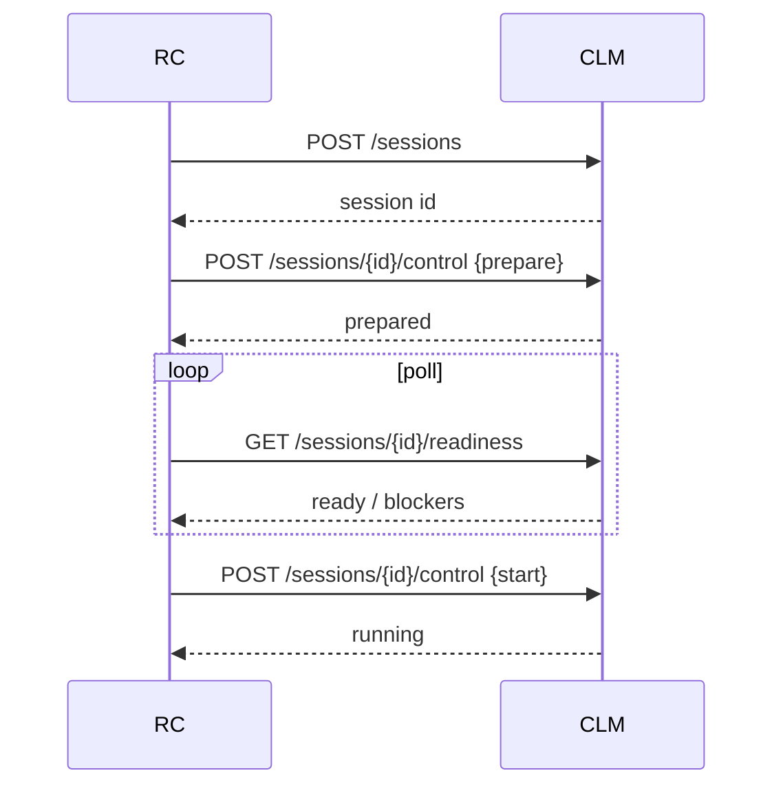
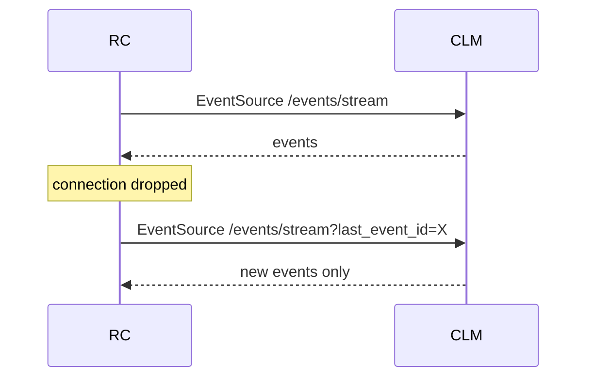
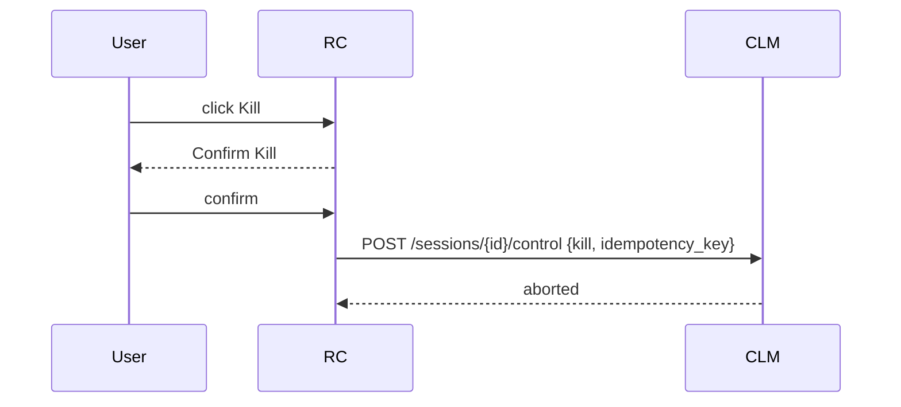
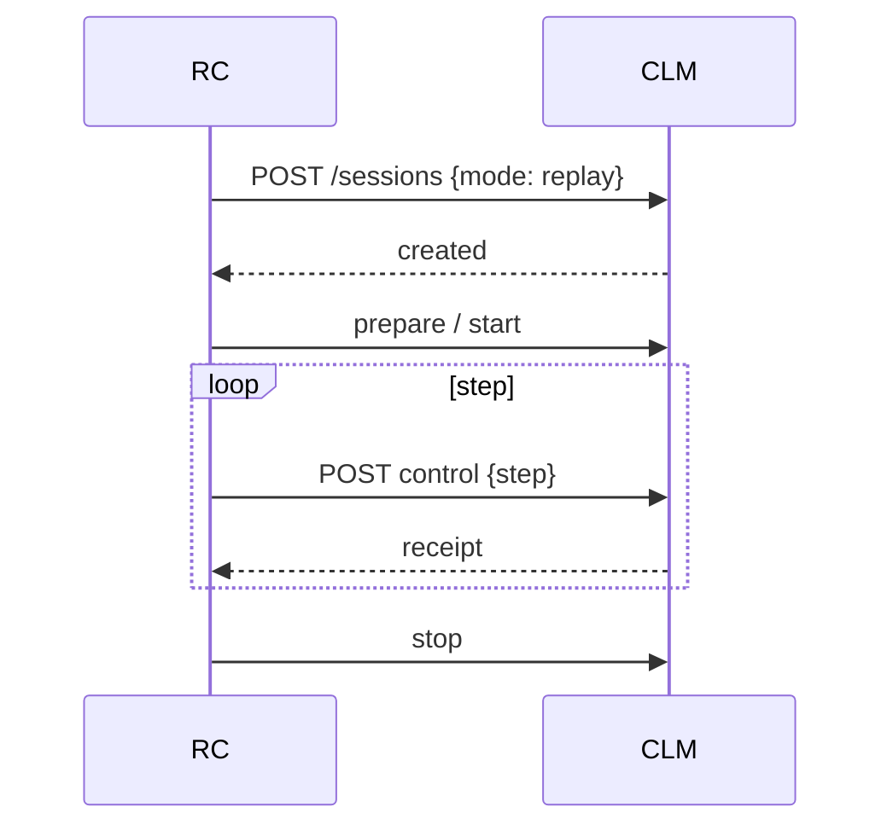
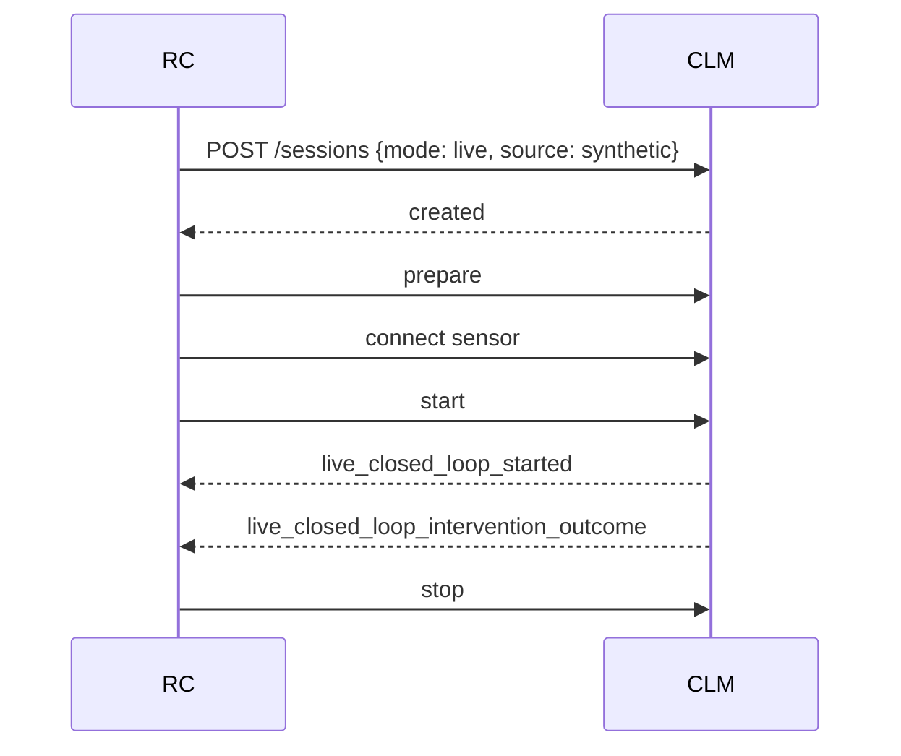

# CLM-05B Research Console

## Scope

The CLM-05B Research Console is a read+control UI for the CLM-05 experimental API. It lets researchers inspect system health, manage experiments, create/prepared/start/stop/kill closed-loop sessions, view real-time SSE events, review session timelines, and export redacted session artifacts.

## Framework

- React 18 + TypeScript 5
- Vite 5+ with React plugin
- Plain accessible CSS (no component library)
- Native `EventSource` for SSE
- Vitest + React Testing Library for unit/integration tests
- Playwright for e2e smoke tests

## API Integration

Routes consumed from `packages/clm/src/mindtune_clm/api/`:

| Resource | Routes |
|----------|--------|
| Health | `GET /api/v1/health`, `GET /api/v1/health/live` |
| Protocols | `GET /api/v1/protocols`, `GET /api/v1/protocols/{id}` |
| Experiments | `GET/POST /api/v1/experiments`, `GET/DELETE /api/v1/experiments/{id}` |
| Sessions | `GET/POST /api/v1/sessions`, `GET/DELETE /api/v1/sessions/{id}`, `GET /api/v1/sessions/{id}/readiness` |
| Control | `POST /api/v1/sessions/{id}/control` |
| Sensors | `GET/POST /api/v1/sensors`, `GET /api/v1/sensors/{id}`, `POST /api/v1/sensors/{id}/connect`, `POST /api/v1/sensors/{id}/disconnect` |
| Stimuli | `GET /api/v1/stimuli`, `GET /api/v1/stimuli/{id}` |
| Events | `GET /api/v1/sessions/{id}/events`, `GET /api/v1/sessions/{id}/events/stream` |
| Exports | `POST /api/v1/sessions/{id}/exports`, `GET /api/v1/sessions/{id}/export/events`, `GET /api/v1/sessions/{id}/export/summary`, `GET /api/v1/sessions/{id}/export/manifest` |

The API client is manually typed from `app.py` and `models.py`. Vite proxies `/api` to `http://127.0.0.1:8000` during development.

## Pages

- **Overview** — API, MPE, sensor, live-loop, voice-cache, renderer, playback, and event-store health with textual badges.
- **Experiments** — list, create, and delete experiments; protocol versions are immutable.
- **Create Session** — select experiment, protocol version, runtime mode (replay / synthetic_live / fc11_live / dry_run), pseudonymous participant ID, sensor source, stimulus set, playback backend, and notes; start is blocked until readiness passes.
- **Live Session** — session state, sensor state, cognitive labels, decision state, audio state, safety controls with idempotency keys, and SSE timeline.
- **Review** — event timeline, causal trace, Hebrew read-only metadata, and exports.
- **System** — sensors, protocols, and health details.

## Session Workflow

1. Create session (`POST /sessions`)
2. Prepare (`POST /sessions/{id}/control {prepare}`)
3. Poll readiness (`GET /sessions/{id}/readiness`)
4. Start (`POST /sessions/{id}/control {start}`)
5. Step / pause / resume / stop / kill via control plane
6. Review events and exports

## Readiness

Readiness is polled every 2s. Blockers such as `missing_aaron_asset` or `rejected_pronunciation_asset` are surfaced and start is disabled until `ready: true`.

## SSE Behavior

`useSessionEvents` opens an `EventSource` to `/api/v1/sessions/{id}/events/stream`. It:
- reconnects automatically on error with `last_event_id`
- suppresses duplicate `event_id` values
- keeps a bounded history (default 1000)
- exposes connection / stale state
- cleans up on unmount; UI disconnect does not stop the backend session

## Reconnect Proof

The SSE hook stores `lastId` and reconnects with `?last_event_id={lastId}`, preventing replays of already-seen events.

## Causal Trace

`CausalTrace` renders the chain:

`ObservationFrame -> CognitiveStateEstimate -> ControlDecision -> ActuationReceipt -> MantraControlState -> VoiceAsset -> AudioAsset -> UtterancePlan -> RenderedAudioArtifact -> PlaybackReceipt -> InterventionOutcome`

Missing links are rendered explicitly as "missing".

## Safety-Control Proof

`SafetyControls` issues commands through `api.controlSession` with unique `idempotency_key` values. `kill` requires a confirmation click and surfaces an `aria-live="polite"` warning before action.

## Replay Session

Replay mode sets `mode: 'replay'`. The UI displays requested vs applied states, fallback reasons, and allows step-wise progression through recorded frames.

## Synthetic-Live Session

Synthetic-live mode sets `mode: 'live'` with a `SyntheticLiveSource`. The UI shows sensor state, live-loop events, and intervention outcomes in the timeline.

## Kill Proof

Clicking `Kill` changes the button to `Confirm Kill` and requires a second click before `POST /sessions/{id}/control {kill}` is sent. The session becomes `aborted`.

## Chart Semantics

Time-series charts (textual summaries) cover accepted/rejected windows, signal quality, packet loss, cognitive labels, intervention level, tempo ratio, pause duration, repetition count, audio switches, loop latency, and playback failures. All charts include visible text summaries and do not rely on color alone.

## Hebrew Read-Only Metadata

The review page displays curriculum item ID, lemma, root, binyan, tense/mood, person, gender, number, register, pointed Hebrew, Italian meaning, morphology validation, pointing provenance, HeLP references, pronunciation-review status, required voice, cache status, and asset checksum. No conjugation, niqqud, Pealim, HeLP, pronunciation, or voice-routing edits are exposed.

## Privacy

- Participant pseudonym only; no real name/email/phone/birth/address fields.
- API token is loaded from `VITE_API_TOKEN` environment variable and never persisted in `localStorage`.
- Exports redact credentials, MAC addresses, absolute paths, and participant identity by default.

## Security

- API base defaults to loopback.
- No wildcard CORS assumptions in the proxy.
- Token is sent in the `Authorization` header only; never in URL or logs.
- Notes are HTML-escaped before display.
- Download filenames are validated.
- Unexpected event shapes are rejected safely.
- No direct filesystem access from browser code.

## Degraded Behavior

When the API is unreachable, health badges show `disconnected` or `failed`. SSE reconnects. Control commands surface stable `ApiError` codes without stack traces.

## Testing

- `npm run lint` — type-only lint
- `npm run typecheck` — TypeScript `tsc --noEmit`
- `npm run test` — Vitest + jsdom unit tests
- `npm run build` — Vite production build
- `npm run test:e2e` — Playwright smoke test (requires browser install)

## Manual Launch

```bash
cd /Users/idonokurasani/Documents/Chatgpt/Biohacking/mindtune_console/apps/research-console
npm install
npm run dev
```

Open http://127.0.0.1:5173. Ensure the CLM-05 API is running on http://127.0.0.1:8000.

## Known Limitations

- Playwright browser installation may fail in restricted/CI environments; the e2e spec is still committed.
- FC11 live mode requires hardware that is not automatically detected.
- The UI does not implement actual speech synthesis, morphology, Pealim, HeLP, or curriculum operations; all Hebrew data is read-only from the API.

## Diagrams

### 1. Console to CLM-05 API

```mermaid
graph LR
  RC[Research Console] -->|HTTP /api| CLM[CLM-05 FastAPI]
  RC -->|SSE /api/v1/sessions/{id}/events/stream| CLM
```

### 2. Session Creation / Readiness



### 3. SSE Reconnect



### 4. Safety Command Flow



### 5. Causal Trace Assembly

```mermaid
graph LR
  OF[ObservationFrame] --> CSE[CognitiveStateEstimate]
  CSE --> CD[ControlDecision]
  CD --> AR[ActuationReceipt]
  AR --> MCS[MantraControlState]
  MCS --> VA[VoiceAsset]
  VA --> AA[AudioAsset]
  AA --> UP[UtterancePlan]
  UP --> RAA[RenderedAudioArtifact]
  RAA --> PR[PlaybackReceipt]
  PR --> IO[InterventionOutcome]
```



### 6. Replay Session



### 7. Synthetic-Live Session


