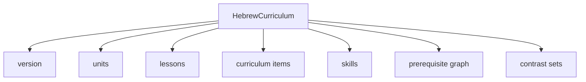
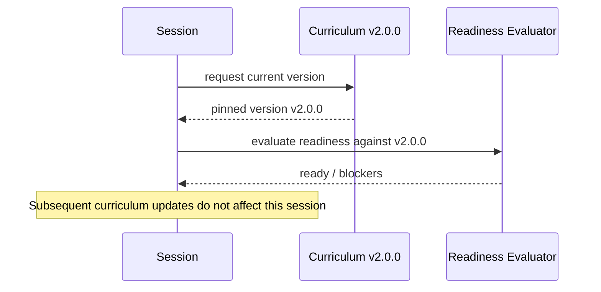
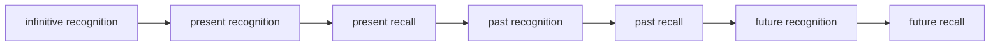
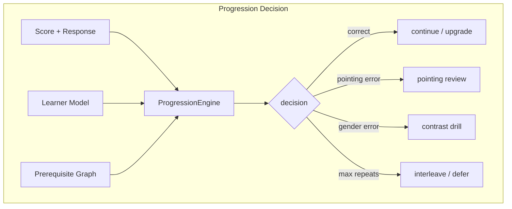
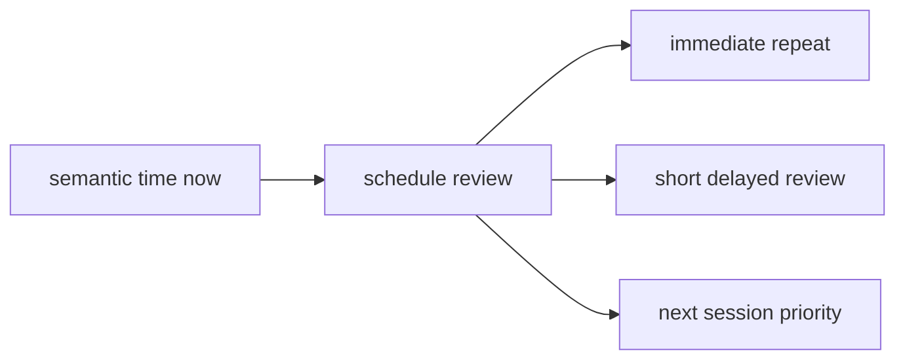
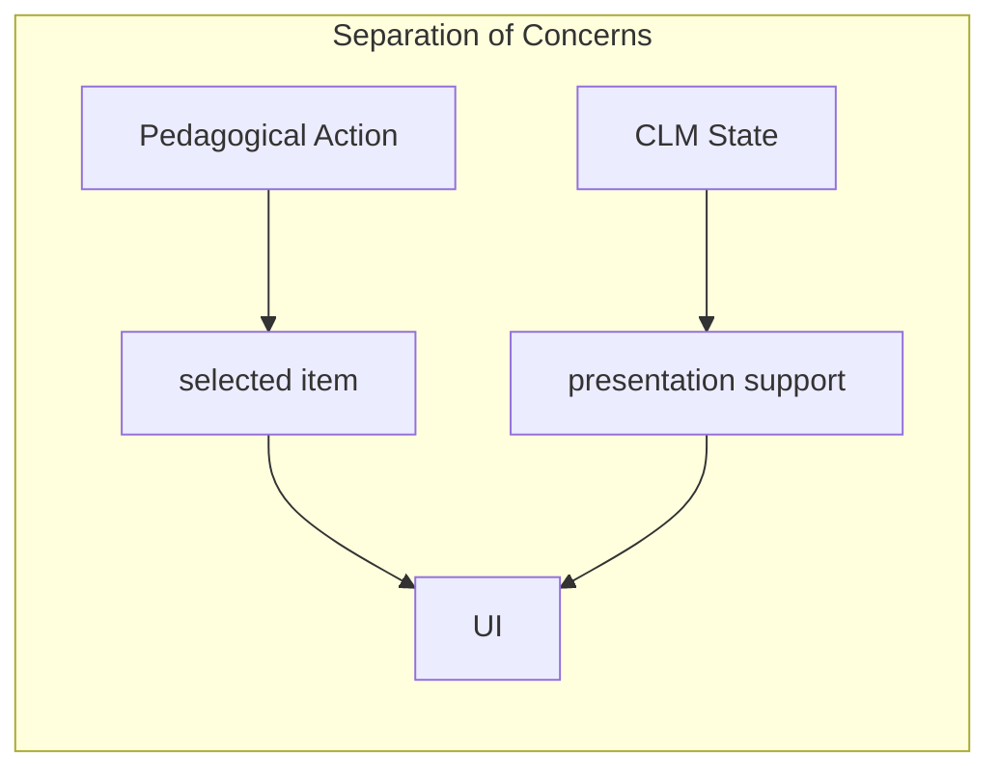
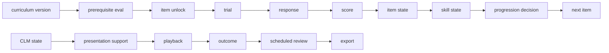

# CLM-06B — Hebrew Curriculum Expansion and Adaptive Progression

## 1. Overview

CLM-06B extends the validated CLM-06 Hebrew adaptive vertical slice into a
versioned curriculum progression system.  The same Hebrew engine, Pealim
integration, Phonikud layer, SVLM resources, Eran Tomer indexes and HeLP
datasets remain upstream; CLM-06B only consumes their validated output and
adds a transparent pedagogical layer on top.

## 2. Curriculum Model

The curriculum is an immutable, versioned artifact built from the audited
CLM-06 approved forms.

Each `HebrewCurriculumItem` carries:

* curriculum/version IDs
* unit/lesson IDs
* skill target IDs
* prerequisite item/skill IDs
* morphology and pointing validation status
* pronunciation review status
* active-learning eligibility and reference-only flags
* accepted alternatives and confusion set IDs
* source provenance and deprecation metadata

## 3. Versioning

A curriculum version is created once and never mutated.  New sessions pin the
exact version they started with; historical session truth remains
reproducible even when the active curriculum advances.

## 4. Skill Graph

The skill graph is a small, transparent DAG.  Examples:

* identify lemma → identify root → identify binyan → identify tense
* identify tense → identify person / gender / number
* recognize pointed form → produce unpointed form → produce pointed form

Skills are not inferred from EEG or attention signals.

## 5. Prerequisite Graph

A directed acyclic graph validates:

* deterministic traversal
* cycle detection
* missing reference detection
* versioned blocking and recommended edges
* optional research overrides

## 6. Readiness

`HebrewCurriculumReadinessEvaluator` produces explicit blockers:

* unresolved morphology
* missing pointed/unpointed canonical forms
* missing translations
* missing or rejected audio assets
* missing provenance
* missing or cyclic prerequisites

An offline asset readiness report lists each required asset, whether it is
present, the voice/locale, the pronunciation review status and cache
compatibility.

## 7. Learner Model

The `HebrewLearnerModel` is pinned to a curriculum version and stores:

* per-item learning states
* per-skill learning states
* exposure history and response accuracy
* response-time and confidence trends
* error profile, pointing accuracy, morphology accuracy
* review history and deferred/blocked/completed item sets
* active difficulty and semantic time

All updates are rule-based and deterministic; no psychometric validity is
claimed beyond the implemented evidence.

## 8. Progression Engine

`HebrewProgressionEngine` emits bounded, deterministic actions:

* introduce / continue / repeat item
* repeat with support
* downgrade recall to recognition
* upgrade recognition to recall
* introduce contrast item
* interleave previous item
* schedule delayed review
* defer / unlock item
* complete lesson / unit
* pause / baseline-lock progression

Progression respects prerequisite mastery, CLM safety state, recent errors,
response time, confidence and HeLP-derived difficulty metadata.

## 9. Review Scheduler

The `HebrewReviewScheduler` supports:

* immediate repeat
* short delayed review
* next-session priority

Scheduling is expressed in semantic time; wall-clock intervals are recorded but
do not replace semantic learning intervals.

## 10. Contrast Sets

Explicit, deterministic contrast sets cover common Hebrew confusions:

* same lemma, different tense/gender/number
* same root, different binyan
* weak-root alternations
* pointed vs unpointed ambiguity
* formal vs common-modern variants
* `להוות`, `להיות`, `להתהוות`

## 11. HeLP Integration

HeLP is used only as enrichment:

* initial difficulty estimate
* ordering and review priority
* expected response-time range
* audit reporting

HeLP does not generate conjugations, alter canonical forms, override
morphology validation, change correctness rules or determine CLM cognitive
state.

## 12. Asset Coverage

Required audio asset roles include:

* Giuseppe grammatical label / Italian meaning / instruction
* Aaron isolated form / contextual sentence / contrast form
* optional tense markers

No SpeechGen calls occur in the fast loop; assets must be cached before an
item becomes active-learning ready.

## 13. MPE and CLM Integration

The separation is preserved:

* the pedagogical action selects what to present
* `MantraControlState` selects how to present it
* CLM may affect presentation support and pacing, not correctness or
  morphology truth
* raw EEG and vendor attention cannot directly unlock or block curriculum
  items

## 14. API Surface

Versioned CLM-06B routes are mounted under `/api/v1/hebrew/`:

* `GET /curricula`
* `GET /curricula/{curriculum_id}`
* `GET /curricula/{curriculum_id}/versions`
* `GET /curricula/{curriculum_id}/readiness`
* `GET /units`
* `GET /units/{unit_id}`
* `GET /skills`
* `GET /learner-state/{session_id}`
* `GET /progression/{session_id}`
* `POST /progression/{session_id}/next`

Mutating `POST /next` is idempotent via an `idempotency_key`.

## 15. Research Console

New read-only pages are available:

* **Curriculum** — version, units, lessons, skills, prerequisite graph,
  readiness, blockers, deprecated items, asset coverage
* **Learner Progression** — current unit/lesson, unlocked/blocked skills,
  item states, scheduled reviews, progression decisions, CLM support state
* **Item Inspection** — morphology, niqqud, provenance, HeLP references,
  accepted alternatives, contrast sets, audio assets, review status

Linguistic truth is never editable through the console.

## 16. Events

CLM-06B emits or supports the following typed events:

* `hebrew_curriculum_loaded`
* `hebrew_curriculum_validated`
* `hebrew_curriculum_readiness_evaluated`
* `hebrew_item_unlocked`
* `hebrew_item_blocked`
* `hebrew_skill_updated`
* `hebrew_unit_started`
* `hebrew_unit_completed`
* `hebrew_review_scheduled`
* `hebrew_review_completed`
* `hebrew_contrast_set_selected`
* `hebrew_progression_decided`
* `hebrew_curriculum_version_pinned`
* `hebrew_item_deprecated`

Events carry causal links to curriculum version, learner state, protocol,
trial, response, score, CLM state and progression decision.

## 17. Full Causal Graph

## 18. Tests

`packages/clm/tests/test_clm06b.py` verifies curriculum versioning,
prerequisite validation, readiness, learner model updates, deterministic
progression, review scheduling, contrast sets, API idempotency and the
CLM/pedagogical separation.  All existing CLM-01 through CLM-06 tests remain
passing.

## 19. Limitations

* The curriculum is built from the audited CLM-06 approved forms; it does not
  implement the entire Hebrew language.
* Progression is rule-based and bounded; it does not implement unrestricted AI
  tutoring.
* Contrast sets are explicit and project-defined, not generated by an LLM.

## 20. Migration Path to CLM-07

CLM-07 Personal Calibration will consume the same `HebrewLearnerModel` and
`HebrewProgressionEngine` interfaces.  Calibration parameters (e.g. mastery
thresholds, response-time bounds) will be attached to the learner model as
versioned metadata without changing the underlying curriculum truth.
