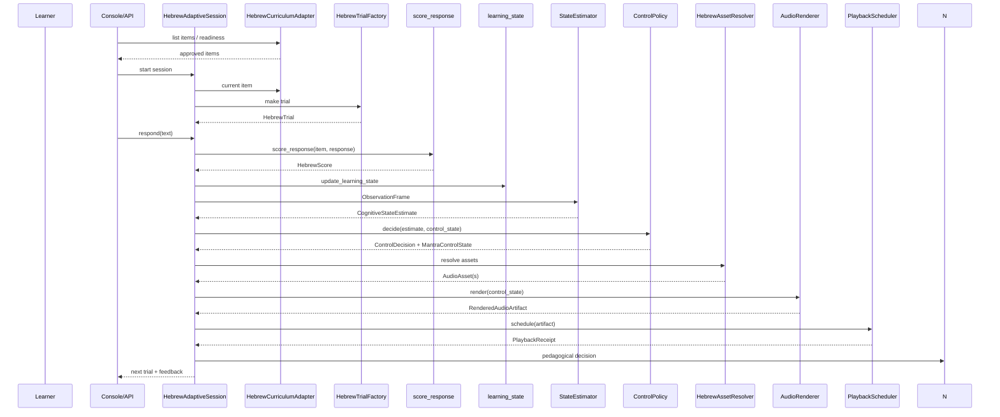
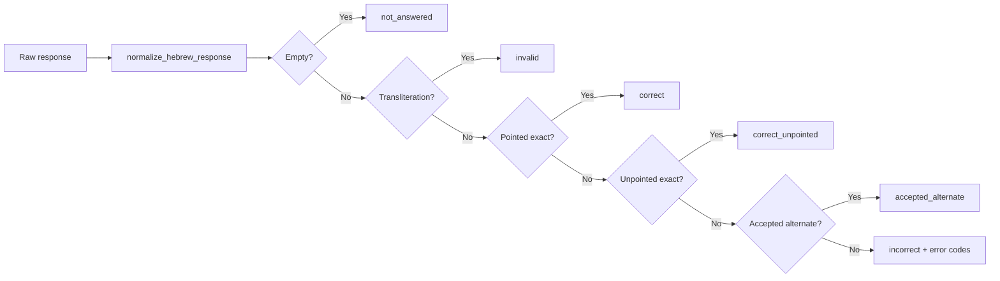
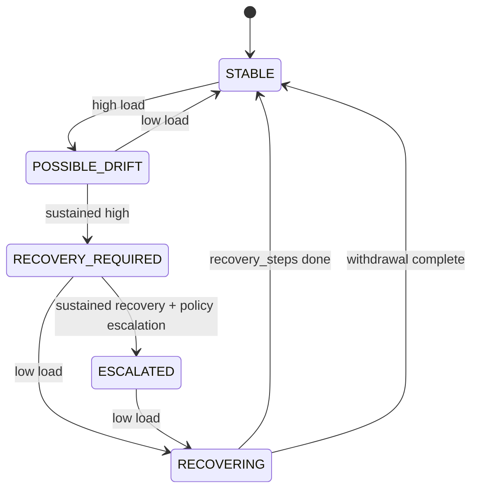
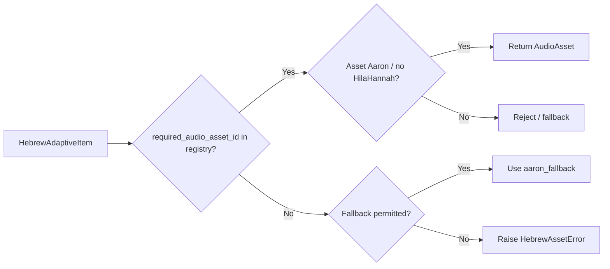
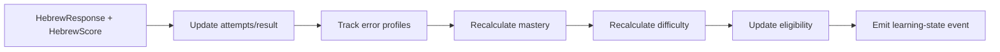

# CLM-06 Hebrew Adaptive Vertical Slice

## Scope

CLM-06 implements the first complete Hebrew-domain adaptive learning vertical slice through the full MindTune closed loop:

```
validated Hebrew curriculum item
  → pedagogical trial
  → learner response
  → behavioral evidence (optional FC11 context)
  → ObservationFrame
  → CognitiveStateEstimate
  → ControlDecision
  → MantraControlState
  → cached Giuseppe/Aaron assets
  → adaptive audio render
  → safe-boundary playback
  → InterventionOutcome
  → learning-state update
  → next Hebrew trial
```

The slice keeps the **CLM audio adaptation** and **pedagogical item selection** dimensions separate:

- CLM audio adaptation may change tempo, pauses, repetitions, prosody, breathing cues and assistance level. It must **never** alter the approved pointed/unpointed Hebrew form or the correct answer.
- The curriculum selector uses the learner's learning state, the current protocol position and the CLM safety state to pick the next item/format. It must **never** recompute CLM policy or use raw EEG/attention as a truth score.

## Reconciliation of existing Hebrew engine components

| Existing component | Exact path | Role | Authority | CLM-06 use |
| --- | --- | --- | --- | --- |
| Hebrew data models | `hebrew/models.py` | `MorphologicalFeatures`, `VerbForm`, `SourceEvidence`, consensus | `hebrew` package | Reused indirectly for field semantics; not imported by the slice. |
| Hebrew validation | `hebrew/validation.py` | `validate_user_answer` | `hebrew` | Reference contract only; CLM-06 scoring is stricter and deterministic. |
| Hebrew normalization | `hebrew/normalization.py` | `strip_niqqud`, `normalize_hebrew` | `hebrew` | Response and content normalization contract referenced; not imported at runtime. |
| MPE Hebrew content | `packages/mpe/src/mpe/domains/hebrew/models.py` | `HebrewContentItem`, `HebrewPromptInstance` | `mpe` | Reused as the upstream content contract; CLM-06 curriculum adapter loads from the same validated JSON source. |
| MPE Hebrew normalization | `packages/mpe/src/mpe/domains/hebrew/normalization.py` | `normalize_hebrew_response`, `is_empty_response` | `mpe` | **Imported** by `scoring.py` and `session.py` for all response normalization. |
| MPE Hebrew adapter | `packages/mpe/src/mpe/domains/hebrew/adapter.py` | `HebrewDomainAdapter` | `mpe` | Reused conceptually; the slice does not duplicate its evaluator. |
| MPE Hebrew fixtures | `packages/mpe/src/mpe/domains/hebrew/fixtures.py` | `make_hebrew_immediate_recall_fixture` | `mpe` | Reused as the reference for immediate-recall contracts. |
| Approved verb data | `data/hebrew/approved/*.json` | Validated Pealim/Phonikud forms | `data/hebrew/approved` | `HebrewCurriculumAdapter` loads approved forms from this directory. |
| Audio fixtures | `packages/clm/src/mindtune_clm/audio/fixture_clm03.py` | `default_registry`, `speech_segment`, `breathing_cue` | `mindtune_clm.audio` | Reused for synthetic test audio; CLM-06 adds Aaron/Giuseppe synthetic fixtures. |
| CLM control state | `packages/clm/src/mindtune_clm/state.py` | `MantraControlState`, `StateEstimator` | `mindtune_clm.state` | **Imported** and used for the closed-loop control state. |
| CLM policy | `packages/clm/src/mindtune_clm/policy.py` | `ControlPolicy` | `mindtune_clm.policy` | **Imported** and used to map estimates to control states. |
| CLM audio renderer | `packages/clm/src/mindtune_clm/audio/renderer.py` | `AudioRenderer` | `mindtune_clm.audio` | **Imported** for deterministic WAV rendering. |
| CLM playback scheduler | `packages/clm/src/mindtune_clm/audio/playback.py` | `PlaybackScheduler` | `mindtune_clm.audio` | **Imported** for safe-boundary playback receipts. |
| Research Console | `apps/research-console/` | React app shell + API client | `research-console` | Extended with a read-only Hebrew session page. |

## New package layout

```
packages/clm/src/mindtune_clm/hebrew_slice/
├── __init__.py
├── models.py                # HebrewAdaptiveItem, HebrewTrial, HebrewResponse, HebrewScore, etc.
├── curriculum_adapter.py    # Load validated forms from data/hebrew/approved
├── trial_factory.py         # Deterministic trial IDs and typed trials
├── prompts.py               # Prompt text and payload builders
├── scoring.py               # Deterministic per-dimension Hebrew scoring
├── error_taxonomy.py        # Canonical error codes and helpers
├── learning_state.py        # Item-level learning-state update and summary
├── adaptation.py            # Pedagogical next-action / next-item policy
├── asset_resolution.py      # Giuseppe/Aaron asset lookup, no SpeechGen fast loop
├── session.py               # Full adaptive session orchestrator
├── events.py                # Typed Hebrew slice events with causal links
└── fixture_clm06.py         # Bounded test fixture with synthetic assets
```

API routes are added in `packages/clm/src/mindtune_clm/api/hebrew.py` and registered in `app.py`.

## Canonical Hebrew learning item

The slice reuses the existing validated Hebrew item shape. Each `HebrewAdaptiveItem` exposes:

- `item_id`, `curriculum_version`, `source_id`
- `lemma`, `lemma_pointed`, `lemma_unpointed`, `root`, `binyan`
- `tense`, `mood`, `person`, `gender`, `number`, `subject`, `register`
- `canonical_pointed`, `canonical_unpointed`, `transliteration`
- `pointed_context_sentence`, `unpointed_context_sentence`
- `italian_gloss`, `natural_italian`
- `morphology_provenance`, `pointing_provenance`, `help_references`
- `linguistic_validation_status`, `pronunciation_review_status`
- `required_audio_asset_ids`, `accepted_alternates`, `error_confusion_set`

Items are loaded from `data/hebrew/approved/*.json` and filtered to `approval_status == "approved"` with zero unresolved conflicts. No production item with unresolved linguistic conflicts is accepted.

## Initial curriculum fixture

The fixture is built deterministically by `make_clm06_test_fixture` from the approved repository content. It currently contains the validated lemmata `להיות`, `לכתוב`, and `לעשות` (PA'AL). The fixture includes:

- infinitive, present, past, future and imperative forms,
- masculine / feminine and singular / plural forms where validated,
- pointed and unpointed isolated forms,
- Italian glosses derived from the approved lemmas,
- synthetic Aaron (`he-IL`) and Giuseppe (`it-IT`) audio assets registered in an `AudioAssetRegistry`.

No SpeechGen synthesis is triggered in the fast loop or in tests.

## Trial types

The slice supports:

1. `italian_to_hebrew` — immediate recall / production.
2. `hebrew_to_italian` — meaning recognition.
3. `hebrew_recognition` — controlled-choice selection.
4. `morphological_decomposition` — grammatical-part recall.
5. `context_completion` — sentence completion with the correct form.
6. `immediate_repetition` — repeat/type the form just presented.

The MPE immediate-recall contract is reused through `normalize_hebrew_response`; no parallel contract is created.

## Response and scoring

`HebrewResponse` records:

- trial ID, item ID, prompt ID, presentation ID
- raw and normalized response, response semantic timestamp, response time
- confidence, hint usage, replay count, audio assistance level
- response mode (`typed`)

`score_response` is deterministic, does not use an LLM, and does not query Pealim. It returns a per-dimension `HebrewScore` with levels:

- `correct`, `correct_unpointed`, `accepted_alternate`, `partially_correct`, `incorrect`, `invalid`, `not_answered`

Dimensions: lemma, root, binyan, tense/mood, person, gender, number, pointed orthography, unpointed orthography, meaning, contextual agreement.

## Error taxonomy

Canonical codes live in `error_taxonomy.py`. Examples:

- `wrong_lemma`, `wrong_root`, `wrong_binyan`, `wrong_tense`, `wrong_mood`, `wrong_person`, `wrong_gender`, `wrong_number`
- `participle_person_confusion`
- `pointed_unpointed_mismatch`, `wrong_niqqud`, `dagesh_error`, `shin_sin_dot_error`
- `subject_verb_disagreement`, `singular_plural_predicate_disagreement`
- `semantically_related_verb_confusion`
- `haya_hava_hit_hava_confusion`
- `modern_formal_variant_mismatch`
- `transliteration_instead_of_hebrew`, `omitted_response`, `invalid_unicode`

## Learning state

`HebrewItemLearningState` tracks:

- presentations, attempts, correct/incorrect counts, last result
- last seen semantic time
- response time and confidence summaries
- morphology-error and pointing-error profiles
- current difficulty estimate, current mastery estimate, scheduled review position
- consecutive failures/successes, assistance history, active-learning eligibility, reference-only flag

Updates are transparent rules; no hidden LLM judgment or EEG-derived truth is used.

## Pedagogical adaptation

`HebrewAdaptationPolicy` decides bounded actions:

- `continue`
- `repeat_same_item`
- `repeat_with_greater_assistance`
- `show_isolated_form`
- `show_contextual_sentence`
- `switch_recognition_to_recall` / `switch_recall_to_recognition`
- `interleave_another_item`
- `defer_item`
- `stop_adaptive_progression`
- `force_baseline_presentation`

It may consider protocol position, eligibility, recent correctness, response time, confidence, error type, exposure, bounded repetition, interleaving, and HeLP difficulty metadata. It must **not** use raw EEG values, vendor attention scores, hidden LLM judgment, live Pealim, or unvalidated morphology.

## CLM presentation mapping

`MantraControlState` is mapped to audio presentation parameters without changing the learning item:

- `tempo_ratio` < 1 → slower playback
- `post_stimulus_pause_ms` > 0 → more recall time
- `repetition_count` > 1 → repeated segment
- `breathing_cue == True` → breathing cue
- `assistance_level` > 0 → prepared pedagogical support variant
- `baseline` → standard presentation

No speech synthesis, conjugation generation or niqqud alteration happens in the fast loop.

## Asset resolution

`HebrewAssetResolver` resolves:

- Italian instructions → Giuseppe (`it-IT`)
- Hebrew forms → Aaron (`he-IL`)

It enforces:

- no Hila, no Hannah
- Aaron uses the current approved pointed `source_text`
- missing required asset blocks readiness or triggers an explicit permitted fallback
- no SpeechGen calls in the fast loop

## Session flow

```mermaid
flowchart LR
    A[Create session] --> B[Readiness check]
    B --> C[Baseline trial]
    C --> D[Present Hebrew trial]
    D --> E[Capture response]
    E --> F[Score response]
    F --> G[Update learning state]
    G --> H[Build ObservationFrame]
    H --> I[Estimate cognitive state]
    I --> J[Control decision]
    J --> K[Resolve Aaron/Giuseppe assets]
    K --> L[Render next-cycle WAV]
    L --> M[Safe-boundary playback]
    M --> N[Pedagogical adaptation]
    N --> O[Prepare next trial]
    O --> D
```



## End-to-end data flow



## Causal event graph

```mermaid
graph TD
    E1[hebrew_session_started] --> E2[hebrew_trial_prepared]
    E2 --> E3[hebrew_trial_presented]
    E3 --> E4[hebrew_audio_asset_resolved]
    E4 --> E5[hebrew_response_submitted]
    E5 --> E6[hebrew_response_scored]
    E6 --> E7[hebrew_error_classified]
    E6 --> E8[hebrew_learning_state_updated]
    E8 --> E9[hebrew_pedagogical_adaptation_decided]
    E9 --> E10[hebrew_trial_repeated | hebrew_item_interleaved | hebrew_item_deferred]
    E10 --> E11[hebrew_assistance_changed]
    E11 --> E12[hebrew_trial_completed]
    E12 --> E13[hebrew_session_completed | hebrew_session_aborted]
```

## API surface

| Method | Path | Purpose | Mutating | Idempotent |
| --- | --- | --- | --- | --- |
| GET | `/api/v1/hebrew/readiness` | Overall readiness | No | N/A |
| GET | `/api/v1/hebrew/items` | List approved items | No | N/A |
| GET | `/api/v1/hebrew/items/{item_id}` | Item details | No | N/A |
| GET | `/api/v1/hebrew/items/{item_id}/readiness` | Per-item asset readiness | No | N/A |
| POST | `/api/v1/hebrew/sessions` | Create Hebrew session | Yes | key optional |
| GET | `/api/v1/sessions/{session_id}/hebrew/state` | Session state | No | N/A |
| GET | `/api/v1/sessions/{session_id}/trials/current` | Current trial | No | N/A |
| POST | `/api/v1/sessions/{session_id}/trials/{trial_id}/response` | Submit response | Yes | key optional |
| GET | `/api/v1/sessions/{session_id}/learning-summary` | Learning summary | No | N/A |

All mutating responses accept an optional `idempotency_key` and return the same result for the same key.

## Research Console integration

`apps/research-console/src/pages/HebrewSessionPage.tsx` adds a read-only Hebrew session experience:

- readiness panel
- validated item selector with provenance display
- start-session control
- trial panel (prompt, pointed Hebrew, Italian meaning)
- response input and feedback panel
- score, cognitive state, and next-action display

Hebrew morphology, Pealim/HeLP/Phonikud, and audio routing remain read-only and are not editable from the console.

## Additional Mermaid diagrams

### 4. Scoring pipeline



### 5. CLM control-state transition



### 6. Asset resolution



### 7. Learning-state update



### 8. API route map

```mermaid
graph LR
    A[Research Console] -->|GET| B[/hebrew/readiness]
    A -->|GET| C[/hebrew/items]
    A -->|GET| D[/hebrew/items/{id}]
    A -->|POST| E[/hebrew/sessions]
    A -->|GET| F[/sessions/{id}/hebrew/state]
    A -->|GET| G[/sessions/{id}/trials/current]
    A -->|POST| H[/sessions/{id}/trials/{trial}/response]
    A -->|GET| I[/sessions/{id}/learning-summary]
```

## Validation commands

- `ruff check packages/clm/src/mindtune_clm/ packages/clm/tests/ packages/mpe/src/mpe/`
- `mypy packages/clm/src/mindtune_clm/hebrew_slice packages/clm/src/mindtune_clm/api/hebrew.py packages/clm/src/mindtune_clm/api/app.py`
- `pytest packages/clm/tests/test_clm06.py -v`
- `pytest packages/mpe/tests -q`
- `npm run lint` and `npm run typecheck` in `apps/research-console/`

## Safety and privacy notes

- No private voice recordings are stored.
- No raw EEG values are used as curriculum truth.
- No SpeechGen credentials or paid generated audio are committed.
- No live Pealim queries are made.
- All FC11 hardware paths remain in the existing `mindtune_clm.live` modules and are not duplicated.
