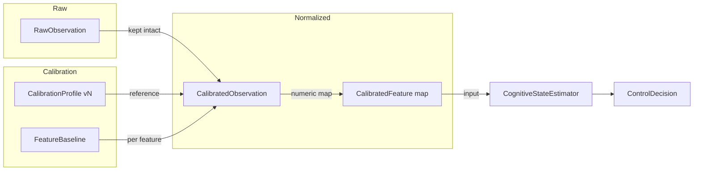
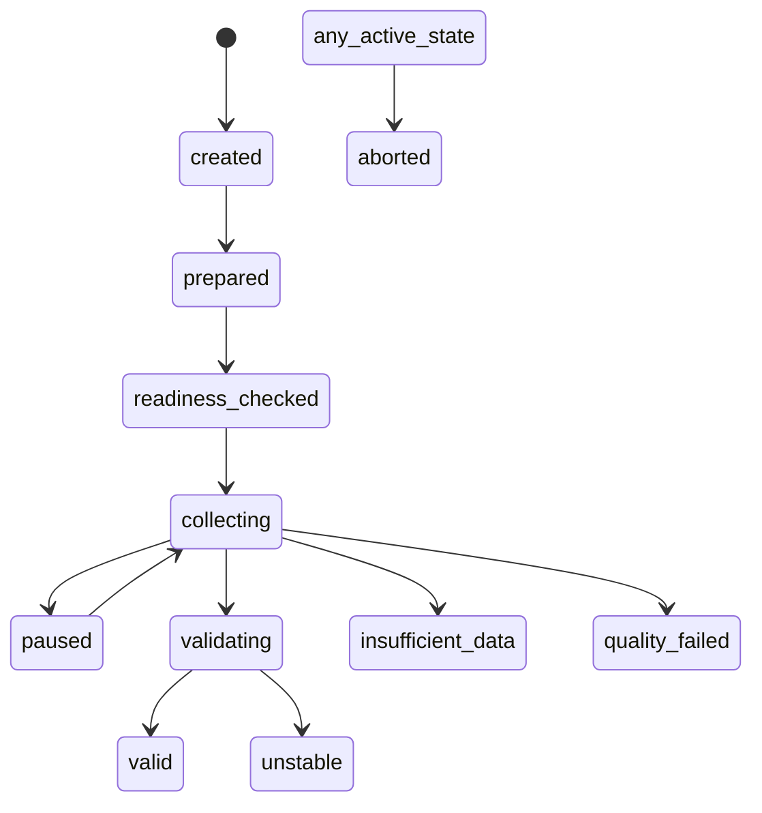
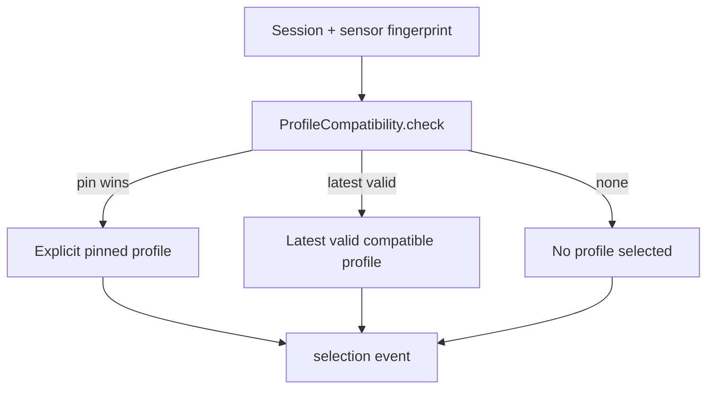
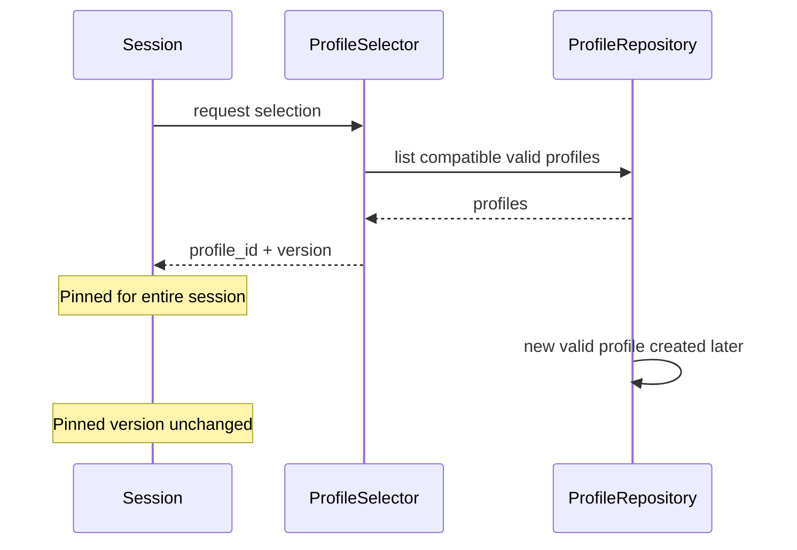
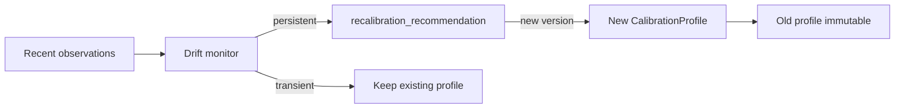
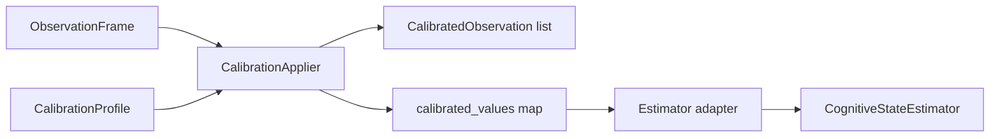
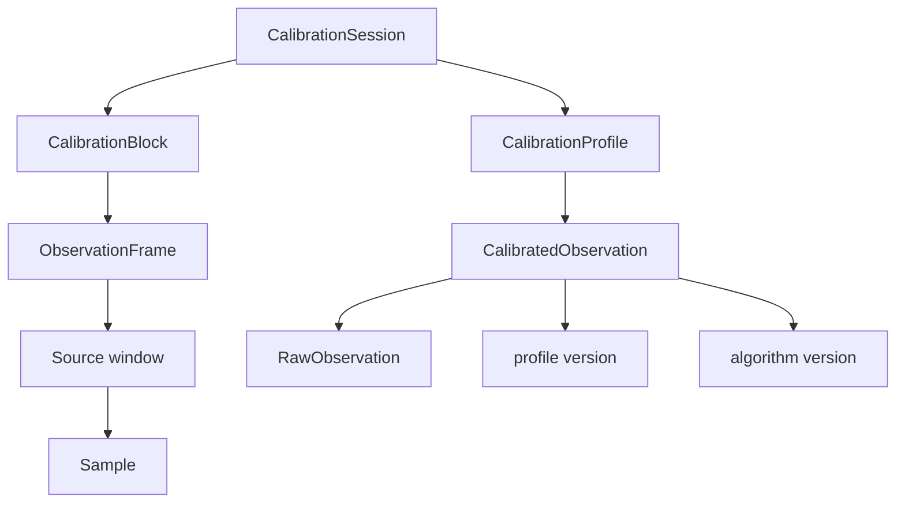
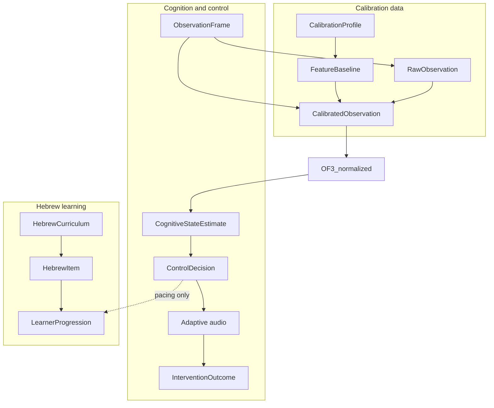

# CLM-07 — Personal Calibration and Individual Baselines

## 1. Architectural Boundary

CLM-07 introduces a transparent, versioned personal-calibration layer between raw sensor/behavioral observations and the existing `CognitiveStateEstimator` / `ControlDecision` pipeline. It never replaces the estimator, control policy, Hebrew engine, MPE protocol engine, or audio pipeline; it only normalizes selected observations relative to an individual's baseline.

The required separation is:

* `RawObservation` — immutable measured or derived source value.
* `CalibrationProfile` — participant-specific reference distribution and validity metadata.
* `CalibratedObservation` / `CalibratedFeature` — normalized interpretation relative to one exact profile version.

Every calibrated value references:

* raw observation ID;
* calibration profile ID and version;
* calibration algorithm version;
* modality;
* transformation / normalization method;
* validity status;
* reason codes.

Raw observations are never overwritten. Calibrated values are produced on demand and stored as events, not as replacements for the source data.

## 2. Participant Identity and Privacy

Only pseudonymous participant IDs are used. The system does not require or store real name, email, phone, date of birth, address, employer, medical record, or device MAC address. A `CalibrationProfile` is scoped to:

* pseudonymous participant ID;
* sensor family;
* sensor configuration fingerprint;
* feature-schema version;
* calibration protocol version.

A profile from one sensor, firmware, electrode placement, or feature schema is not silently reused for another. All exports redact credentials, MAC addresses, serial numbers, and real identity fields.

## 3. Calibration Protocols

Protocols are versioned `CalibrationProtocol` instances stored in `packages/clm/src/mindtune_clm/calibration/protocol.py`. The built-in CLM-07 protocol (`clm07.personal-baseline` / `v1`) defines four blocks:

1. **Resting baseline** — short bounded segment with no active Hebrew trial, baseline audio or silence, movement and signal-quality checks; no claim that "rest" equals a clinical resting state.
2. **Low-load task baseline** — simple validated task with known trial structure, bounded duration, behavioral response collection, no adaptive escalation.
3. **Moderate-load task baseline** — controlled increase in task demand using existing MPE task contracts.
4. **Recovery baseline** — post-task observation period used to estimate return toward individual reference state.

Blocks are kept separate; statistics are not collapsed into one undifferentiated average.

## 4. Calibration Session State Machine

`CalibrationSession` in `packages/clm/src/mindtune_clm/calibration/models.py` tracks the lifecycle:

Failure paths include `insufficient_data`, `retryable`, `quality_failed`, `unstable`, and `aborted`. Transitions emit typed calibration events to the event store.

## 5. Readiness

A calibration session may start only when `CalibrationReadinessEvaluator` (`packages/clm/src/mindtune_clm/calibration/health.py`) confirms:

* participant pseudonym exists;
* protocol is valid;
* sensor configuration is available;
* sensor quality is acceptable;
* required task assets are cached;
* event store is writable;
* no incompatible active sensor owner exists;
* playback backend is ready where required;
* safety controller is ready;
* feature-schema version is known.

The readiness response is `ready: true | false` plus `blocking_reasons` and `warnings`.

## 6. Feature Baselines (`FeatureBaseline`)

For each supported feature a `FeatureBaseline` records:

* feature name, modality, unit;
* sample, accepted, rejected, and missing counts;
* central tendency (median by default) and dispersion (MAD / IQR);
* robust minimum and maximum;
* selected quantiles;
* outlier policy;
* distribution-shape metadata where transparently computed;
* stability metrics;
* quality status;
* transformation recommendation;
* algorithm version (`clm07.robust.v1`).

## 7. Robust Statistics

`packages/clm/src/mindtune_clm/calibration/robust_stats.py` provides:

* `median` — deterministic;
* `mad` — median absolute deviation;
* `quantile` / `quantiles` — deterministic bounded quantiles;
* `percentile_rank`;
* `zero_dispersion` guard.

Mean and standard deviation are used only when justified and documented. Normality is never assumed by default.

## 8. Quality Filtering and Rejection Codes

`ObservationQualityGate` in `packages/clm/src/mindtune_clm/calibration/quality.py` accepts or rejects each observation. Rejected observations are preserved with reason codes:

* artifact;
* movement;
* packet loss;
* stale window;
* disconnected interval;
* malformed record;
* missing behavioral response.

`QualitySummary` tracks accepted/rejected/missing counts, artifact rate, and movement contamination rate. Rejected observations never enter baseline statistics.

## 9. Stability Validation

A profile does not become valid solely because the minimum sample count is reached. `BaselineEstimator.estimate_session` and `validate_stability` check:

* sufficient duration;
* sufficient accepted observations;
* bounded missingness;
* bounded artifact rate;
* bounded movement contamination;
* sample-rate stability;
* connection-epoch compatibility;
* feature drift within calibration blocks;
* agreement between repeated comparable blocks;
* absence of impossible values;
* estimator convergence.

Thresholds are read from the `CalibrationProtocol` version, not derived silently from the same data.

## 10. Normalization Methods

Explicit, versioned methods are supported in `CalibrationProtocol.normalization_defaults`:

* `robust_z` — `(x - median) / scaled_mad`;
* `percentile` — percentile position from quantiles;
* `bounded_relative_change` — relative change over the robust span;
* `baseline_ratio` — only for strictly positive compatible features;
* `categorical_deviation` — binary deviation from central label;
* `none` — passthrough.

Zero or near-zero dispersion is handled explicitly with reason codes such as `calibration_zero_dispersion`.

## 11. Profile Compatibility

`ProfileCompatibility.check` in `packages/clm/src/mindtune_clm/calibration/compatibility.py` compares at least:

* participant pseudonym;
* sensor family;
* parser version compatibility;
* feature-schema version;
* channel configuration;
* sample-rate policy;
* quality-policy version;
* calibration-protocol applicability;
* task domain where relevant.

A profile created for FC11 does not automatically apply to another EEG device or to an incompatible feature schema.

## 12. Profile Selection

`ProfileSelector` is deterministic:

1. If an explicit pinned compatible profile is requested, use it and record `explicit_pinned_compatible_profile`.
2. Otherwise pick the latest valid compatible profile by `end_semantic_time` with a deterministic `profile_id` tie-break, recording `latest_valid_compatible_profile`.
3. If none match, return `no_compatible_profile`.

Degraded, expired, incompatible, and superseded profiles are not silently selected.

## 13. Active-Session Profile Pinning

At session start the selected profile ID and version are pinned. An active session does not switch profiles silently. New profiles created during the session are available to future sessions but do not retroactively change the pinned version.

## 14. Recalibration and Drift Monitoring

Recalibration is triggered explicitly by:

* no valid profile;
* profile incompatible;
* feature schema changed;
* sensor configuration changed;
* profile expired by protocol rule;
* persistent baseline drift across sessions;
* repeated calibration-quality failures;
* explicit researcher request.

`recalibration_recommendation` in `packages/clm/src/mindtune_clm/calibration/profiles.py` emits a recommendation event; it never recalibrates inside an active adaptive session and never mutates the current profile.

Drift monitoring distinguishes:

* short-term state deviation;
* persistent baseline drift (requires at least three compatible sessions);
* sensor-quality degradation;
* sensor-configuration change;
* insufficient evidence.

One difficult session is not treated as baseline drift.

## 15. Behavioral Calibration

Response time and confidence are calibrated by trial type. The system:

* preserves correctness strata;
* avoids comparing incomparable tasks;
* uses robust summaries;
* distinguishes omitted responses, incorrect fast guesses, and correct slow responses.

There is no single universal response-time baseline across all Hebrew tasks.

## 16. FC11 and Vendor Metric Handling

For FC11:

* quality-approved EEG-derived features may be calibrated;
* vendor `attention` and `meditation` remain contextual, with separate feature names and provenance;
* vendor scores are not treated as physiological truth;
* profile-relative vendor changes are not presented as clinical findings.

Raw EEG amplitude is not calibrated across incompatible acquisition configurations.

## 17. Estimator Integration

`CalibrationApplier` in `packages/clm/src/mindtune_clm/calibration/application.py` maps a `CalibrationProfile` onto an `ObservationFrame`, producing `CalibratedObservation` records and a numeric `calibrated_values` map. The existing `CognitiveStateEstimator` consumes the map through a narrow adapter. The estimator can abstain when:

* no compatible profile exists and the protocol requires one;
* calibration is invalid;
* required calibrated features are missing;
* sensor quality is unusable.

No normalized values are fabricated.

## 18. Policy Separation

The `ControlPolicy` continues to consume typed state estimates. Calibration affects control only through the state-estimation contract. Same raw observation + different compatible profiles may yield different calibrated features and different state estimates, but the same state estimate always yields the same control decision. The policy remains participant-agnostic.

## 19. Hebrew-Learning Separation

Calibration does not affect canonical Hebrew forms, niqqud, translations, accepted answers, morphology scoring, pronunciation assets, or item prerequisites. It may affect presentation support, pacing, abstention, intervention threshold through the existing estimator and policy, and readiness when a protocol requires a valid profile.

## 20. API Changes

Calibration routes are mounted in `packages/clm/src/mindtune_clm/api/app.py` under `/api/v1`:

* `POST   /calibrations`
* `GET    /calibrations`
* `GET    /calibrations/{calibration_id}`
* `POST   /calibrations/{calibration_id}/prepare`
* `POST   /calibrations/{calibration_id}/start`
* `POST   /calibrations/{calibration_id}/pause`
* `POST   /calibrations/{calibration_id}/resume`
* `POST   /calibrations/{calibration_id}/stop`
* `POST   /calibrations/{calibration_id}/abort`
* `GET    /calibrations/{calibration_id}/readiness`
* `GET    /calibrations/{calibration_id}/health`
* `GET    /calibrations/{calibration_id}/summary`
* `GET    /participants/{participant_id}/calibration-profiles`
* `GET    /participants/{participant_id}/calibration-profiles/{profile_id}`
* `POST   /participants/{participant_id}/calibration-profiles/{profile_id}/validate`
* `POST   /participants/{participant_id}/calibration-profiles/{profile_id}/invalidate`
* `POST   /participants/{participant_id}/calibration-profiles/{profile_id}/select`
* `GET    /participants/{participant_id}/calibration-status`

All mutations are idempotent. Invalidation requires a reason. No arbitrary baseline editing is allowed.

## 21. Research Console Changes

`apps/research-console` adds:

* **Calibration overview** page (`CalibrationOverviewPage`) — participant pseudonym, current valid profile, compatibility, feature coverage, warnings, recalibration recommendation, previous profiles.
* **Calibration session** page (`CalibrationSessionPage`) — protocol blocks, current block, elapsed time, sensor health, accepted/rejected windows, stability, readiness blockers, pause/resume/stop/abort controls.
* **Profile review** page (`CalibrationProfilePage`) — profile provenance, feature baselines, robust center/dispersion, accepted counts, missingness, stability, compatibility constraints, algorithm versions, invalidation history, drift recommendations; typed actions: validate, invalidate with reason, start recalibration, select for future session.
* **Live-session display** (`CalibrationLivePanel`) — pinned calibration profile, raw-vs-calibrated feature summary, compatibility, coverage, abstention/warnings.

The console API client (`apps/research-console/src/api/client.ts`) and shared models (`apps/research-console/src/api/models.ts`) were extended with the new calibration types and endpoints.

## 22. Events

Typed calibration events are emitted by `make_calibration_event` in `packages/clm/src/mindtune_clm/calibration/events.py`:

* `calibration_session_created`
* `calibration_readiness_evaluated`
* `calibration_collection_started`
* `calibration_observation_accepted`
* `calibration_observation_rejected`
* `calibration_block_completed`
* `calibration_stability_evaluated`
* `calibration_profile_created`
* `calibration_profile_validated`
* `calibration_profile_invalidated`
* `calibration_profile_superseded`
* `calibration_profile_selected`
* `calibration_profile_rejected_as_incompatible`
* `calibrated_observation_created`
* `calibration_drift_detected`
* `calibration_recalibration_recommended`
* `calibration_session_aborted`

Causal links are preserved: `CalibrationProfile` → sessions → blocks → `ObservationFrame` → source windows → samples, and `CalibratedObservation` → raw observation + exact profile version + exact algorithm version.

## 23. Exports

Deterministic exports are supported for:

* calibration session events;
* calibration profile manifest;
* feature-baseline table;
* quality and rejection summary;
* compatibility report;
* drift report;
* profile-selection history.

Exports exclude credentials, MAC addresses, real identity, raw private recordings by default, and personal absolute paths. Checksums are SHA-256 over stable JSON.

## 24. Synthetic Scenarios

`fixture_clm07.py` provides deterministic scenarios covering:

* A — valid stable calibration;
* B — insufficient data;
* C — unstable baseline;
* D — movement contamination;
* E — incompatible sensor configuration;
* F — zero dispersion;
* G — behavioral calibration by trial type;
* H — persistent drift with recalibration recommendation;
* I — two participants, same raw observation, different calibrated values;
* J — active-session pinning.

## 25. Smoke Tests

`packages/clm/tests/test_clm07.py` (42 tests) validates the model, statistics, profile lifecycle, compatibility, selection, estimator integration, policy separation, Hebrew separation, and two-participant isolation. A manual smoke workflow can exercise the API end-to-end using synthetic sensors and deterministic playback, without SpeechGen, real FC11, or private recordings. An optional FC11 hardware smoke test may be run separately; no hardware success is claimed unless actually executed.

## 26. Full Causal Graph

## 27. Limitations

* Profiles are in-memory only in this phase; persistence is CLM-08.
* Only the supported evidence streams listed in the scope are calibrated.
* No new sensors are added.
* No medical diagnosis or condition inference is performed.
* Vendor metrics remain contextual, never ground truth.

## 28. Migration Path to CLM-08 Scientific Validation

CLM-07 establishes the immutable, auditable calibration pipeline. CLM-08 will:

* add persisted, versioned profile storage with provenance indexing;
* add inter-session scientific validation of baseline stability;
* support blinded replay-vs-live equivalence for calibrated features;
* add statistical reporting for research review;
* integrate formal cross-validation of normalization choices.

The same raw/calibrated separation, causal event chain, and policy separation will carry forward unchanged.
