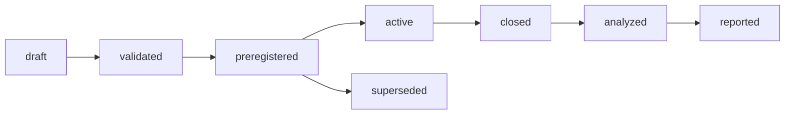
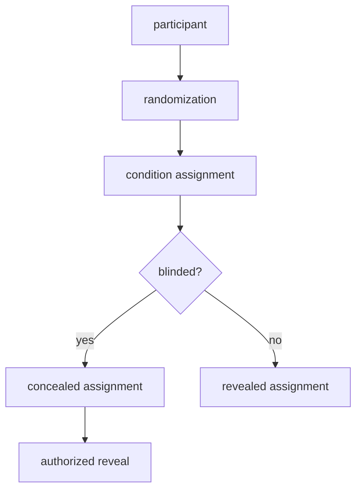
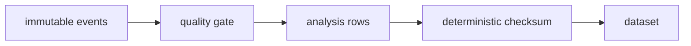
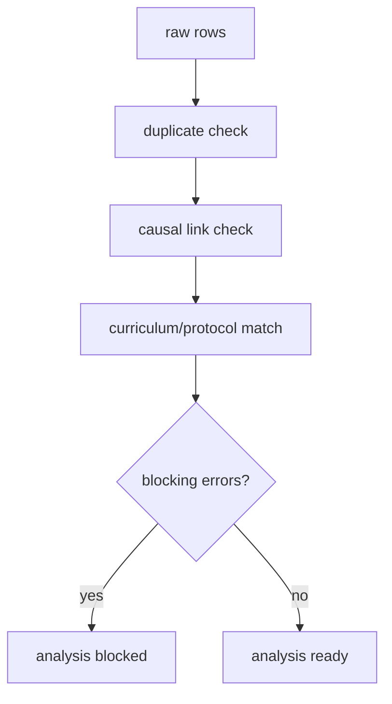
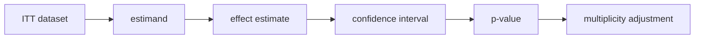
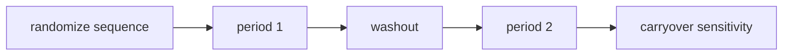
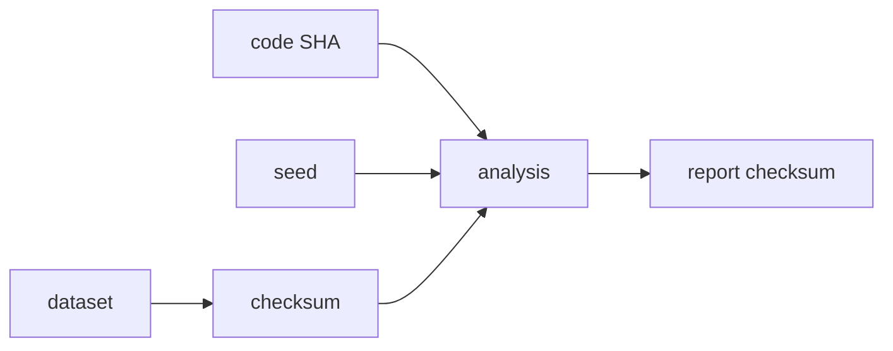
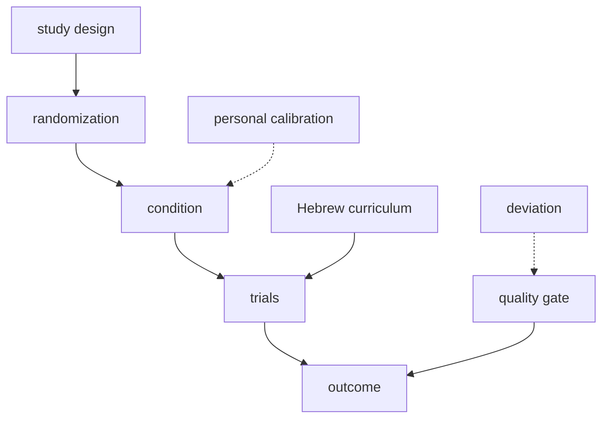

# CLM-08 Scientific Validation and Experimental Evidence Framework

## Scope

CLM-08 adds a scientific-validation layer to MindTune Lab. It evaluates whether the adaptive closed-loop presentation used by CLM-01 through CLM-07 produces measurable, reproducible differences compared with fixed or sham presentations, without changing the system being evaluated.

The framework supports:

- preregistered, versioned study definitions;
- explicit confirmatory and exploratory hypotheses;
- deterministic randomization (simple, blocked, stratified, crossover);
- blinded condition assignment and concealment;
- typed endpoints, estimands, and analysis populations;
- protocol-deviation capture with prespecified consequences;
- data-quality gating;
- deterministic analysis datasets and exports;
- transparent statistics with effect estimates and uncertainty;
- multiplicity handling, missing-data policies, and sensitivity analyses;
- reproducible reports.

CLM-08 does **not** add medical outcomes, treat vendor attention/meditation scores as validated endpoints, or allow analysis code to feed back into active-session policy.

## Research questions

The primary research question is:

> Does adaptive CLM presentation improve immediate Hebrew recall accuracy relative to fixed baseline presentation during a prespecified evaluation block?

Secondary questions cover response time, confidence, error profiles, safety overrides, protocol adherence, and sensor/context mechanisms.

## Preregistration

Study definitions are immutable frozen dataclasses. Status flow:

```
draft -> validated -> preregistered -> active -> closed -> analyzed -> reported
```

Once `preregistered`, any change creates a new version with an incremented `study_version`. Preregistration is enforced by `StudyStatus` and the validation service.

## Hypotheses

Each hypothesis declares:

- `hypothesis_id`, `type` (confirmatory/exploratory);
- concrete `null_statement` and `alternative_statement`;
- `estimand` (population, treatment, comparator, outcome, summary measure);
- `endpoint`, `population`, `comparison`, `directionality`;
- `significance_threshold`, `multiplicity_family`, `analysis_method`;
- `missing_data_handling` and `sensitivity_analyses`.

Example confirmatory hypothesis: among eligible Hebrew-learning sessions, adaptive CLM presentation improves immediate-recall accuracy relative to fixed baseline, measured as the participant-level mean difference in correctly recalled trials.

## Conditions

1. **Adaptive CLM** — state estimator, personal calibration, control policy, adaptive audio, prespecified curriculum progression.
2. **Fixed baseline** — same items and trial structure, baseline audio only, no adaptive control-state changes.
3. **Sham adaptation** — apparent audio variation independent of participant state, same bounded range, no live cognitive-state estimate.
4. **Calibrated / uncalibrated** — only where explicitly included in the design.

## Sham design

Sham logic is deterministic and preregistered. The sham condition stores `{"sham": True}` and does **not** activate `state_estimator` or `control_policy`. It is designed to avoid accidentally reproducing the true policy.

## Randomization

`mindtune_clm.validation.randomization` implements:

- `simple_randomization`;
- `blocked_randomization`;
- `stratified_randomization`;
- `crossover_sequence_randomization`;
- `latin_square_ordering`.

All algorithms use a seeded `random.Random` instance and record the seed, algorithm, and allocation ratio. They never use outcomes.

## Crossover support

Crossover allocations carry `period` and `sequence_order`. Sensitivity specs include `exclude_first_period` and `carryover` assessment. The dataset builder preserves period and order for period-effect estimation.

## Blinding

Blinding levels: `unblinded`, `participant-blinded`, `assessor-blinded`, `analyst-blinded`, `partially-blinded`. Assignments carry `concealed` and `revealed_to`. The public view hides `condition_id` for blinded viewers until reveal is logged.

## Endpoints

`Endpoint` objects are typed as `primary`, `secondary`, or `exploratory` and include metric, timepoint, direction, and units. Primary candidates are immediate-recall accuracy, delayed within-session recall, next-session retention, response time among correct responses, and prespecified composites only.

## Estimands

Supported estimands: participant-level mean difference, trial-level risk difference, trial-level odds ratio, median response-time difference, paired difference, retention change, condition-by-time interaction, and intervention-exposure effects (exploratory unless randomized).

## Analysis populations

- `intention-to-treat`;
- `modified-intention-to-treat`;
- `per-protocol`;
- `safety`;
- `complete-case`;
- `high-quality-sensor` subset.

The primary confirmatory analysis defaults to intention-to-treat.

## Protocol deviations

`ProtocolDeviation` records `deviation_id`, `session_id`, `participant_pseudonym`, `category`, `severity`, `detection_time`, `description`, `prespecified_consequence`, `inclusion_impact`, `event_references`, and `reviewer_status`. Deviations are retained; they are never deleted.

## Quality gate

`evaluate_dataset_quality` checks event-chain integrity, duplicates, missing causal links, missing trials, invalid timestamps, impossible response times, missing condition assignments, curriculum/protocol mismatches, calibration-profile mismatches, asset mismatches, missing playback receipts, incomplete outcomes, sensor coverage, and export checksums. It returns `analysis_ready`, `blocking_errors`, and `warnings`.

## Datasets

`AnalysisDataset` is built from `AnalysisRow` records. Each row references study/participant/session, period, condition, protocol and curriculum versions, calibration profile, trial/item, response, correctness, response time, confidence, error types, CLM state, intervention exposure, audio artifact, safety events, sensor summary, inclusion flags, and deviation flags. Checksums are deterministic SHA-256 over stable JSON.

## Statistics

`mindtune_clm.validation.statistics` provides:

- descriptive summaries;
- paired and independent mean/median differences;
- risk difference and odds ratio with CIs;
- bootstrap percentile CIs;
- permutation tests;
- exact binomial and Wilson proportion CIs;
- Cohen's d / standardized effect size;
- participant-level aggregation;
- cluster-aware bootstrap resampling.

P-values are always reported with effect estimates and confidence intervals.

## Multiplicity

`apply_multiplicity` supports `none`, `hierarchical` placeholder, `holm`, and `fdr` (Benjamini-Hochberg). Raw and adjusted p-values remain distinct.

## Missing data

Default policy is transparent no imputation plus sensitivity analyses. Options include `conservative_failure` and `sensitivity_bounds`. The analysis pipeline distinguishes dropout, abort, omitted response, sensor missingness, playback failure, and corrupted event chains.

## Sensitivity analyses

Built-in sensitivity specs cover:

- intention-to-treat vs per-protocol;
- all sessions vs high-sensor-quality subset;
- complete-case vs conservative missing treatment;
- excluding first-period crossover data;
- carryover-adjusted analyses.

Results are explicitly labelled `sensitivity_label`.

## Sample-size rationale

Stored in `sample_size_rationale` with `alpha`, `power`, `target_effect`, `baseline_rate`, and expected attrition. The framework does not claim exact power for unimplemented models.

## Sequential monitoring

Sequential monitoring is disabled by default. When preregistered, it supports fixed interim looks, alpha-spending, futility boundaries, and safety-only monitoring. The Research Console does not display rolling confirmatory p-values during active blinded studies unless explicitly allowed.

## Reproducibility

Every `AnalysisResult` records:

- `analysis_id`;
- `study_id` and `study_version`;
- `plan_id` and `hypothesis_id`;
- `dataset_checksum`;
- `population` and `estimand_summary`;
- `effect_estimate`, `confidence_interval`, `p_value`, `raw_p_value`, `adjusted_p_value`;
- `included_sessions`, `excluded_sessions`;
- `seed` and `code_sha`;
- `limitations`.

The same dataset, code SHA, and seed produce identical effect estimates and report checksums.

## Reports

`StudyReport` generates Markdown, JSON, and CSV outputs with sections for study manifest, CONSORT-style flow, data quality, deviations, primary/secondary/sensitivity analyses, safety, limitations, and a cautious interpretation. Reports never claim clinical benefit or cognitive enhancement.

## API changes

New routes under `/api/v1`:

- `POST /studies`;
- `GET /studies`;
- `GET /studies/{study_id}`;
- `POST /studies/{study_id}/validate`;
- `POST /studies/{study_id}/preregister`;
- `POST /studies/{study_id}/close`;
- `POST /studies/{study_id}/assignments`;
- `GET /studies/{study_id}/assignments/{participant_id}`;
- `GET /studies/{study_id}/quality`;
- `GET /studies/{study_id}/deviations`;
- `POST /studies/{study_id}/analyses`;
- `GET /studies/{study_id}/analyses`;
- `GET /studies/{study_id}/analyses/{analysis_id}`;
- `GET /studies/{study_id}/reports` (via `POST /reports`).

Mutations are idempotent. Preregistration locks the study version. Concealed assignment information is not exposed to unauthorized viewers during active blinded studies.

## Research Console changes

Added `ScientificValidationPage` and a `Validation` tab in `AppShell`. The page lists study ID, title, status, and primary endpoint, and displays effect estimates and confidence intervals from the analysis view. It does not use significance-only badges.

## Synthetic scenarios

`fixture_clm08.py` provides deterministic fixtures for:

- A — randomized parallel adaptive vs fixed;
- B — sham-controlled adaptive vs sham;
- C — crossover adaptive vs fixed;
- D — protocol deviations;
- E — missing data;
- F — corrupted event chain;
- G — reproducibility;
- H — analysis-plan mutation attempt.

## Limitations

- CLM-08 is a validation scaffold; it does not generate real-study evidence.
- Fixtures are synthetic and must not be interpreted as clinical outcomes.
- Effect estimates are conditional on the prespecified analysis plan.

## Migration path to CLM-09 Production Hardening

CLM-08 produces immutable study definitions, datasets, and reproducible reports that can be promoted to CLM-09 production hardening by locking component versions, adding persistent event-store backends, and completing audit logging.

## Mermaid diagrams

### 1. Study lifecycle



### 2. Assignment and concealment



### 3. Session-to-analysis dataset



### 4. Quality gate



### 5. Confirmatory analysis



### 6. Crossover flow



### 7. Reproducibility chain



### 8. Full causal graph


